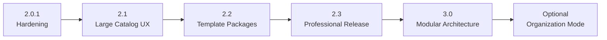

# jmoney — Handoff 6 Steps & Cross-Machine Roadmap

เอกสารนี้เป็นแหล่งอ้างอิงหลัก (source of truth) ของ Roadmap และ Handoff ทั้ง 6 ขั้น

เอกสารนี้เป็นดัชนีกลางสำหรับพัฒนา jmoney ต่อจากรุ่น `2.0.0` บนหลายเครื่องหรือหลาย Codex task

Handoff ชุดนี้มีหน้าที่บอกว่า:

- แต่ละรุ่นต้องแก้ปัญหาอะไร
- ต้องเริ่มจากสถานะใด
- ขอบเขตไหนทำและไม่ทำ
- งานใดต้องเสร็จก่อนงานใด
- ต้องตรวจอะไรจึงถือว่าเวอร์ชันนั้นเสร็จ
- หากหยุดกลางทาง เครื่องหรืองานถัดไปต้องรับช่วงอย่างไร
- ควรใช้ Chat prompt หรือ `/goal`

เอกสารนี้ไม่ใช่บันทึกงานค้างชั่วคราวของแชตใดแชตหนึ่ง แต่เป็นแผนพัฒนาผลิตภัณฑ์ที่ต้องอัปเดตตาม release จริง

---

## 1. สถานะฐานก่อนเริ่ม Roadmap

รุ่นฐาน:

```text
jmoney / ReimbursementDocApp 2.0.0
```

ความสามารถที่มีแล้ว:

- WinForms desktop app แบบ offline/local-first
- สร้าง DOCX หลายฉบับจากข้อมูลชุดเดียว
- System Template มาตรฐาน 5 ฉบับ
- กลุ่มเอกสาร
- Import DOCX ผ่าน Windows File Picker
- Template lifecycle: `Draft`, `Invalid`, `Active`
- System Tag และ Custom Tag
- Custom Tag: Text, Multiline, Number, Date, Choice
- Validate document/Header/Footer/split runs
- Trial render ก่อน Activate
- Atomic catalog save
- Backup, restore และ remove-with-recovery
- Upgrade-safe installer
- Acceptance tests 46 รายการ
- Installer tests 19 รายการ
- Installer ZIP, Source ZIP และ legacy backup

ข้อจำกัดฐาน:

- หน้าหลักยังไม่มี Search/Filter เอกสาร
- TreeView เลื่อนได้ แต่รายการจำนวนมากต้องเลื่อนหา
- ทุก refresh ยังสามารถ inspect DOCX หลายไฟล์ซ้ำ
- ไม่มี logging/support bundle แบบเป็นระบบ
- backup ยังไม่มี retention policy
- source code หลักยังเผยแพร่เป็น ZIP มากกว่าการ track รายไฟล์ใน repository
- ไม่มี GitHub Actions release pipeline
- installer ยังไม่มี code signing
- class หลักมีขนาดใหญ่และความรับผิดชอบหลายด้าน

---

## 2. Architecture Decision ที่ใช้ตลอด Roadmap

เลือกแนวทาง:

```text
Offline Modular Monolith
```

ไม่เปลี่ยนเป็น microservices, web app หรือ cloud platform ใน Roadmap หลัก

เหตุผล:

- ผู้ใช้หลักทำงานบน Windows เครื่องเดียว
- ข้อมูลและเอกสารควรอยู่ในเครื่อง
- ทีมพัฒนาขนาดเล็ก
- workflow ไม่ต้องการ server เพื่อสร้าง DOCX
- deployment หนึ่งชุดยังเหมาะสม
- ความซับซ้อนปัจจุบันอยู่ที่โครงสร้าง code/UI/catalog ไม่ใช่ horizontal scaling

หลักถาวร:

- DOCX เป็น source of truth ด้าน layout
- Catalog เป็น source of truth ด้านกลุ่ม แม่แบบ lifecycle และ Custom Tag
- ห้ามให้ Draft/Invalid เข้าหน้าผู้ใช้ทั่วไป
- ห้ามทำลาย saved data, output หรือ User Template ตอน upgrade
- ทุก schema change ต้องมี migration และ rollback
- ทุก release ต้องสร้างซ้ำได้จาก source และ tests

---

## 3. Roadmap และ Dependency



| ลำดับ | Version/Phase | เป้าหมาย | วิธีสั่ง Codex ที่แนะนำ |
|---:|---|---|---|
| 1 | 2.0.1 Hardening | logs, diagnostics, repair, retention, stress baseline | `/goal` |
| 2 | 2.1 Large Catalog UX | search/filter/collapse/cache สำหรับเอกสารจำนวนมาก | `/goal` |
| 3 | 2.2 Template Packages | import/export ชุดกระบวนการเอกสาร | `/goal` |
| 4 | 2.3 Professional Release | track source, CI/CD, installer metadata/signing readiness | `/goal` |
| 5 | 3.0 Modular Architecture | แยก domain/application/infrastructure/UI | `/goal` |
| 6 | Optional Organization Mode | หลายเครื่อง/สิทธิ์/ประวัติ/การแชร์ | Chat discovery ก่อน แล้วจึง `/goal` |

ห้ามข้ามไป 3.0 ก่อน 2.3 เพราะการ refactor ใหญ่ต้องมี source tracking และ CI ที่ตรวจ regression ได้ก่อน

---

## 4. ไฟล์ Handoff ราย Phase

- [Phase 2.0.1 — Hardening](./STEP-01-HANDOFF-2.0.1-HARDENING.md)
- [Phase 2.1 — Large Catalog UX](./STEP-02-HANDOFF-2.1-LARGE-CATALOG-UX.md)
- [Phase 2.2 — Template Packages](./STEP-03-HANDOFF-2.2-TEMPLATE-PACKAGES.md)
- [Phase 2.3 — Professional Release](./STEP-04-HANDOFF-2.3-PROFESSIONAL-RELEASE.md)
- [Phase 3.0 — Modular Architecture](./STEP-05-HANDOFF-3.0-MODULAR-ARCHITECTURE.md)
- [Optional — Organization Mode](./STEP-06-HANDOFF-OPTIONAL-ORGANIZATION.md)

---

## 5. วิธีเริ่มงานบนคอมเครื่องใหม่

### 5.1 ดึง repository

```powershell
git clone https://github.com/RobbyGrean/jmoney.git
Set-Location .\jmoney
git status -sb
git pull --ff-only origin main
```

หาก repository มีอยู่แล้ว:

```powershell
git status -sb
git fetch origin
git pull --ff-only origin main
```

ห้าม pull ทับเมื่อมี local changes ที่ยังไม่ทราบเจ้าของ ให้ตรวจ diff ก่อน

### 5.2 เตรียม Source Workspace

ก่อน Phase 2.3 source workspace ยังถูก ignore และ source เผยแพร่ใน ZIP

แตก:

```text
assets\downloads\ReimbursementDocApp-Source.zip
```

ไปยัง:

```text
ReimbursementDocApp-Source\
```

ตรวจว่ามี:

```text
ReimbursementDocApp.cs
TemplateCatalog.cs
TemplateAdminCenter.cs
Installer.cs
build-exe.ps1
run-acceptance-tests.ps1
run-installer-tests.ps1
```

### 5.3 ตรวจ Baseline

```powershell
Set-Location .\ReimbursementDocApp-Source
powershell -ExecutionPolicy Bypass -File .\build-exe.ps1
powershell -ExecutionPolicy Bypass -File .\run-acceptance-tests.ps1
powershell -ExecutionPolicy Bypass -File .\run-installer-tests.ps1
```

Baseline ต้องผ่าน:

```text
Acceptance: 46/46
Installer: 19/19
```

หาก baseline ไม่ผ่าน ห้ามเริ่ม feature ของ Phase ให้แก้ environment หรือความไม่ตรงของ source ก่อน

---

## 6. กฎร่วมสำหรับ Codex ทุกเครื่อง

ให้ Prompt หรือ Goal ทุก Phase รักษากฎเหล่านี้:

1. อ่าน `README.md`, `Handof6steps/README.md` และ Handoff ของ Phase ปัจจุบันให้ครบ
2. ตรวจ `git status`, branch และ remote ก่อนแก้
3. ทำงานเฉพาะใน project `jmoney`
4. ห้ามแก้หรือลบไฟล์อื่นในคอม
5. ห้ามเปลี่ยน business rule โดยเดาเอง
6. ห้ามเปลี่ยนความหมาย System Tag โดยไม่มี mapping และ tests
7. รักษา layout/font/spacing/table/Header/Footer ของ DOCX
8. รักษา legacy backup แบบ byte-for-byte
9. รักษา upgrade-safe installer
10. ห้ามบรรจุ saved data, output, backup หรือ test executable ลง package
11. ใช้ `apply_patch` เมื่อแก้ไฟล์ข้อความ/source แบบเจาะจง
12. รัน tests ตาม risk ของงาน
13. อัปเดต version, changelog, docs และ checksum เมื่อออก release
14. ห้าม commit/push จนเจ้าของสั่งอย่างชัดเจน
15. หากหยุดกลาง Phase ต้องอัปเดต section `Checkpoint` ของ Phase นั้น

---

## 7. Chat Prompt กับ /goal ต่างกันอย่างไร

### ใช้ Chat Prompt เมื่อ

- ต้องสำรวจ requirement
- ต้องตัดสินใจ architecture
- ต้องวิเคราะห์ไฟล์หรือปัญหาเฉพาะจุด
- ยังมีคำถามที่เจ้าของระบบต้องตอบ
- ยังไม่พร้อมให้ Codexแก้จนจบทั้งเวอร์ชัน

Chat task ควรจบด้วย:

- ข้อค้นพบ
- decision ที่ยืนยันแล้ว
- unresolved questions
- proposed file changes
- acceptance criteria

### ใช้ /goal เมื่อ

- scope และ decision ชัดแล้ว
- ต้องทำงานหลายรอบต่อเนื่อง
- ต้องแก้ source + tests + docs + build
- ต้องการให้ Codex ทำจนผ่าน Definition of Done
- อนุญาตให้ดำเนินงาน local แบบต่อเนื่อง

Goal ต้องระบุ terminal condition ชัด:

```text
เสร็จเมื่อ tests ผ่าน, migration/rollback ผ่าน, docs/package/checksum ตรง
และไม่มีงาน required ของ Phase เหลือ
```

Goal ไม่ได้ให้อำนาจ commit/push โดยอัตโนมัติ ต้องสั่งแยก

---

## 8. Definition of Done ร่วมทุก Version

แต่ละรุ่นเสร็จเมื่อ:

- scope required เสร็จทั้งหมด
- non-goal ไม่ถูกดึงเข้ามาโดยไม่อนุมัติ
- tests เดิมไม่ regression
- tests ใหม่ครอบคลุม feature และ failure path
- migration จาก release ล่าสุดผ่าน
- rollback/recovery ผ่าน
- fresh install และ upgrade install ผ่านเมื่อเกี่ยวข้อง
- Source ZIP ไม่มีข้อมูลผู้ใช้
- Installer ZIP มี payload ครบ
- version ตรง EXE, Installer, VERSION, docs และ changelog
- SHA-256 ใน README ตรงไฟล์จริง
- Handoff Phase อัปเดตจาก `Planned/In Progress` เป็น `Complete`
- checkpoint ระบุ commit/release ที่เสร็จจริง
- working tree ถูกตรวจและไม่มีไฟล์นอก scope

---

## 9. Checkpoint Format เมื่อหยุดกลางงาน

อัปเดตท้าย Handoff ของ Phase:

```markdown
## Checkpoint ล่าสุด

- วันที่:
- เครื่อง/Workspace:
- Branch:
- Base commit:
- สถานะ: Planned | In Progress | Blocked | Complete
- งานที่เสร็จ:
- งานที่กำลังทำ:
- งานที่เหลือ:
- Files changed:
- Tests ล่าสุด:
- Package/checksum:
- Decision ที่ยืนยันแล้ว:
- Blocker/คำถามเจ้าของ:
- คำสั่งเริ่มต่อ:
```

ห้ามเขียนเพียง “ทำต่อจากเดิม” เพราะเครื่องถัดไปต้องตรวจสอบได้โดยไม่เห็นบทสนทนาเก่า

---

## 10. Release และ Git Policy

- ทำ feature และทดสอบใน local ก่อน
- สร้าง branch เมื่อต้องการแยกงานยาว
- ห้าม force push `main`
- ห้ามแก้ legacy ZIP
- ก่อน commit ให้ตรวจ:

```powershell
git status -sb
git diff --check
git diff --stat
```

- ก่อน push ให้ fetch และตรวจ divergence
- commit/push เฉพาะเมื่อเจ้าของสั่ง
- หาก Phase ใหญ่ควร commit แยกตาม migration, feature, tests และ docs แต่ไม่แยกจน build ไม่ผ่าน

---

## 11. สถานะ Roadmap

| Phase | สถานะเริ่มต้น | Owner/Task | Release |
|---|---|---|---|
| 2.0.1 | Planned | ยังไม่เริ่ม | — |
| 2.1 | Planned | ยังไม่เริ่ม | — |
| 2.2 | Planned | ยังไม่เริ่ม | — |
| 2.3 | Planned | ยังไม่เริ่ม | — |
| 3.0 | Planned | ยังไม่เริ่ม | — |
| Optional Organization | Discovery only | ยังไม่อนุมัติ implementation | — |

Phase ถัดไปที่ควรเริ่ม:

```text
2.0.1 Hardening
```
