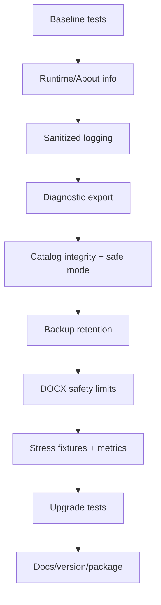

# Phase Handoff — jmoney 2.0.1 Hardening

สถานะเริ่มต้น: `Planned`  
รุ่นฐาน: `2.0.0`  
รุ่นเป้าหมาย: `2.0.1`  
Dependency: ไม่มี Phase ใหม่ แต่ baseline tests ต้องผ่าน  
วิธีสั่งงานที่แนะนำ: `/goal`

---

## 1. เป้าหมาย

ทำให้ระบบ 2.0 ดูแล แก้ปัญหา และกู้คืนได้ง่ายก่อนขยายจำนวนเอกสาร

ผลลัพธ์หลัก:

- รู้ว่า EXE ที่เปิดอยู่เป็น version ใดและติดตั้งที่ไหน
- มี application log ที่ไม่เก็บข้อมูลเอกสารเกินจำเป็น
- Export diagnostic report ได้
- Catalog เสียแล้วมี recovery path
- Backup ไม่โตแบบไม่มีขอบเขต
- DOCX ผิดปกติหรือมีขนาดเกินกำหนดถูก block
- มี stress baseline สำหรับ catalog ขนาดใหญ่

---

## 2. Scope Required

### 2.1 About / Runtime Information

เพิ่มหน้า `เกี่ยวกับโปรแกรม`:

- Product name
- App version
- Catalog schema version
- Install/base path
- Template path
- Output path
- จำนวนกลุ่ม
- จำนวน Active/Draft/Invalid Template
- จำนวน System/Custom Tag
- ปุ่ม Copy diagnostic summary

ห้ามแสดง token, credential หรือข้อมูลที่ผู้ใช้กรอก

### 2.2 Logging

เพิ่ม local structured log สำหรับ event:

- app start/exit
- catalog load/migrate/save
- template import
- validate/activate
- custom tag add/rename/remove
- backup/restore
- document generation success/failure
- installer upgrade result

แต่ละ event ควรมี:

```text
timestamp
event type
severity
template/group ID เมื่อเกี่ยวข้อง
file name ที่ไม่รวมข้อมูลส่วนตัว
result/error category
app version
```

ห้าม log:

- ชื่อบุคคล
- ที่อยู่
- เงินเดือน
- ค่าที่แทนลง Tag
- เนื้อหาเอกสาร

### 2.3 Diagnostic Export

เพิ่มปุ่มสร้าง Support Bundle เช่น:

```text
jmoney-diagnostic-YYYYMMDD-HHmmss.zip
```

อนุญาตให้บรรจุ:

- version/runtime summary
- sanitized log
- catalog schema summary
- template filenames/status/tag names
- hash ของ template
- recent error summaries

ห้ามบรรจุ:

- saved_templates.json
- output DOCX
- DOCX template จริงโดยอัตโนมัติ
- user-entered values
- backup binary

ก่อน export ต้องมีหน้าสรุปสิ่งที่จะบรรจุ

### 2.4 Catalog Integrity & Repair

ตอน startup:

1. อ่าน catalog
2. ตรวจ schema/version
3. ตรวจ Groups/Templates/CustomTags null/duplicate/orphan
4. ตรวจไฟล์ DOCX ที่อ้างถึง
5. ถ้าเสีย ให้หยุดการเขียนทับ
6. เสนอ restore จาก backup ล่าสุด
7. ถ้า restore ไม่ได้ ให้เปิด safe mode ที่ไม่ generate

Repair ต้องไม่เดาความหมายของ Tag

### 2.5 Backup Retention

เพิ่ม retention policy:

- configuration backups: เก็บล่าสุด 20 ชุด
- installer-upgrade backups: เก็บล่าสุด 5 ชุด
- removed template recovery: ไม่ลบอัตโนมัติใน 30 วันแรก
- validation temp: ล้างเมื่อจบงาน

ก่อนลบ backup:

- resolve path
- ยืนยันว่าอยู่ใต้ `admin-backups`
- ห้ามตาม symlink/reparse point ออกนอก root
- log จำนวนชุดที่ลบ

ให้ผู้ใช้เลือกปิด auto-cleanup ได้

### 2.6 DOCX Safety Limits

ก่อน inspect/import:

- จำกัด file size แบบตั้งค่าได้ ค่าเริ่มต้นเช่น 25 MB
- จำกัดจำนวน ZIP entries
- จำกัด total uncompressed size
- block encrypted/corrupt package
- block path traversal entry
- มี error message ที่ผู้ใช้เข้าใจได้

### 2.7 Stress Baseline

สร้าง test data จำลอง:

- 50 templates
- 100 templates
- 500 templates
- 20 groups
- 100 Custom Tags

เก็บเวลา:

- catalog load
- template tree build
- validation
- dynamic field rebuild

Phase นี้ยังไม่ต้อง optimize ใหญ่ แต่ต้องสร้าง baseline ที่ Phase 2.1 ใช้เปรียบเทียบ

---

## 3. Non-Goals

- ยังไม่เพิ่ม Search/Filter หน้าหลัก
- ยังไม่ทำ validation cache
- ยังไม่ทำ Template Package
- ยังไม่เปลี่ยน installer technology
- ยังไม่ย้าย JSON เป็น SQLite
- ยังไม่ refactor architecture ใหญ่
- ยังไม่ทำ cloud logging หรือ telemetry

---

## 4. Source Area ที่คาดว่าจะเปลี่ยน

- `ReimbursementDocApp.cs`
- `TemplateCatalog.cs`
- `TemplateAdminCenter.cs`
- `Installer.cs`
- ไฟล์ใหม่ด้าน logging/diagnostics หากแยกได้โดยไม่ refactor ใหญ่
- acceptance tests
- installer tests
- README / Guide / CHANGELOG / VERSION

หากเพิ่มไฟล์ service ใหม่ ให้คง compatible กับ compiler/runtime ปัจจุบัน

---

## 5. Implementation Sequence



แนะนำ commit boundaries เมื่อได้รับอนุญาต:

1. diagnostics/logging
2. integrity/retention/security
3. tests/docs/release

---

## 6. Acceptance Criteria

- About แสดง `2.0.1` และ path จริง
- Diagnostic summary ไม่มีค่าข้อมูลบุคคล
- Support Bundle ผ่าน allowlist inspection
- Catalog JSON เสียแล้วไม่ถูกเขียนทับ
- Restore จาก backup ล่าสุดทำงาน
- Safe mode ไม่อนุญาต generate
- Retention ไม่ลบไฟล์นอก `admin-backups`
- DOCX เกิน limit ถูก block ก่อนแตก package
- DOCX ปกติ 5 ฉบับยังผ่าน
- stress fixtures สร้างและวัดผลซ้ำได้
- 46 acceptance tests เดิมผ่าน
- 19 installer tests เดิมผ่าน
- tests ใหม่ผ่าน
- fresh install และ upgrade 2.0.0 → 2.0.1 ผ่าน

---

## 7. Tests ที่ต้องเพิ่ม

- log redaction
- diagnostic allowlist
- malformed catalog
- duplicate group/template/tag ID
- orphan GroupId
- missing DOCX
- valid/invalid backup restore
- retention boundary และ path guard
- oversized DOCX
- excessive ZIP entries
- path traversal ZIP entry
- corrupt/encrypted DOCX
- safe mode generation block
- 50/100/500 template fixture load

---

## 8. Migration

Schema ควรเปลี่ยนเท่าที่จำเป็น

หากเพิ่ม settings:

- ไม่มี settings เดิม → ใช้ default
- settings เดิมไม่ครบ → เติมค่าใหม่
- ห้ามลบ unknown property ที่อาจมาจากรุ่นถัดไปโดยไม่จำเป็น

ก่อนเปลี่ยน catalog/settings:

- backup
- write atomic
- verify read-back

---

## 9. Rollback

Rollback trigger:

- startup catalog repair ทำให้ catalog เปลี่ยนโดยไม่ตั้งใจ
- log เก็บข้อมูลส่วนบุคคล
- retention ลบ path ผิด
- upgrade ทำข้อมูลผู้ใช้หาย

Rollback:

1. หยุด release
2. คืน catalog/settings จาก backup
3. คืน Installer/Source 2.0.0
4. เก็บ diagnostic ที่ sanitize แล้ว
5. เพิ่ม regression test ก่อนทำต่อ

---

## 10. Prompt สำหรับ Chat ก่อนเริ่ม Goal

ใช้เมื่ออยากให้ Codex ตรวจแผน/โค้ดก่อน ยังไม่ให้แก้:

```text
อ่าน README.md, ROADMAP_HANDOFF_TH.md และ
docs/roadmap/PHASE-2.0.1-HARDENING.md ให้ครบ

ตรวจ source รุ่น 2.0.0 และรายงาน:
1. จุดที่ควรวาง logging โดยไม่เก็บ PII
2. catalog failure paths และ recovery paths ปัจจุบัน
3. backup directories และ path guards ที่มีอยู่
4. DOCX import/inspection limits ที่ยังไม่มี
5. test files ที่ต้องขยาย
6. proposed files/classes โดยหลีกเลี่ยง refactor ใหญ่

ยังไม่แก้ไฟล์ ไม่ build ไม่ commit ไม่ push
ผลลัพธ์ต้องเป็น implementation plan, risk list และ acceptance matrix
ที่อ้างอิง method/class จริงใน source
```

---

## 11. /goal พร้อมใช้

```text
/goal พัฒนา jmoney จาก 2.0.0 เป็น 2.0.1 ตาม docs/roadmap/PHASE-2.0.1-HARDENING.md ให้ครบ ทำเฉพาะในโปรเจกต์ jmoney: เพิ่ม About/runtime info, sanitized local logging, diagnostic support bundle แบบ allowlist, catalog integrity check + safe mode + restore, backup retention ที่มี path guard, DOCX safety limits และ stress baseline 50/100/500 templates รักษา offline/local-first, DOCX layout, saved data, output, User Template, legacy backup และ upgrade-safe installer ห้ามทำ Search/Filter, Template Package, เปลี่ยน installer technology หรือ refactor architecture ใหญ่ เพิ่ม tests ของ success/failure/security paths รัน baseline และ tests ใหม่จนผ่าน อัปเดต version/README/Guide/CHANGELOG/Source package/checksum และอัปเดต Checkpoint ใน Handoff เสร็จเมื่อ Acceptance/Installer/upgrade/security/package checks ผ่านทั้งหมดและไม่มี required scope เหลือ ห้าม commit หรือ push จนกว่าจะได้รับคำสั่งชัดเจน
```

---

## 12. Checkpoint ล่าสุด

- วันที่: 2026-07-29
- Branch: ตรวจจากเครื่องที่เริ่มงาน
- Base release: 2.0.0
- สถานะ: Planned
- งานที่เสร็จ: Handoff และ scope definition
- งานที่กำลังทำ: —
- งานที่เหลือ: Scope ทั้งหมด
- Tests ล่าสุดจากรุ่นฐาน: Acceptance 46, Installer 19
- Blocker: ไม่มี
- คำสั่งเริ่มต่อ: ใช้ `/goal` ในหัวข้อ 11

