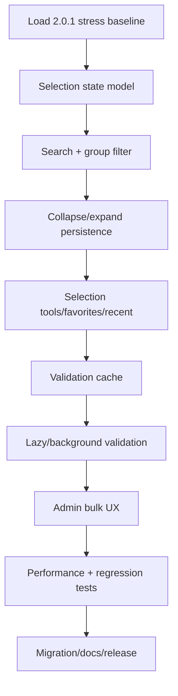

# Phase Handoff — jmoney 2.1 Large Catalog UX

สถานะเริ่มต้น: `Planned`  
รุ่นฐาน: `2.0.1`  
รุ่นเป้าหมาย: `2.1.0`  
Dependency: Phase 2.0.1 เสร็จและมี stress baseline  
วิธีสั่งงานที่แนะนำ: `/goal`

---

## 1. เป้าหมาย

ให้หน้าหลักและศูนย์ผู้ดูแลใช้งานได้ดีเมื่อมีเอกสารหลายสิบถึงหลายร้อยฉบับ โดยไม่ต้องเลื่อนหาอย่างเดียวและไม่ inspect DOCX ซ้ำโดยไม่จำเป็น

Target scale:

```text
20 groups
500 templates
100 Custom Tags
```

---

## 2. Current Behavior ที่ต้องรักษา

- TreeView แบ่งรายการตามกลุ่ม
- vertical scrollbar แสดงอัตโนมัติ
- checkbox กลุ่มเลือก/ยกเลิกลูกทั้งหมด
- แสดงเฉพาะ Active Template
- Draft/Invalid อยู่ใน Admin Center
- แสดง selected count
- dynamic fields มาจาก union ของ Tag ในเอกสารที่เลือก
- group sort ใช้ SortOrder แล้วตามชื่อ
- tooltip แสดง validation result

---

## 3. Scope Required

### 3.1 Search

เพิ่มช่องค้นหาหน้าหลัก:

- ค้น DisplayName
- ค้น Description
- ค้น FileName
- ค้นชื่อกลุ่ม
- ไม่สนตัวพิมพ์ใหญ่/เล็ก
- รองรับภาษาไทย
- debounce เพื่อไม่ rebuild ทุก keystroke

เมื่อค้น:

- แสดงกลุ่มที่มีผลลัพธ์
- expand กลุ่มผลลัพธ์
- highlight หรือแสดงข้อความว่ากรองอยู่
- selection ของรายการที่ถูกซ่อนไม่ควรหายโดยไม่เตือน

ต้องกำหนด policy ชัด:

```text
Filter hides nodes but preserves selected template IDs.
Generate uses selected IDs, not only visible nodes.
```

หรือเลือก policy อื่น แต่ต้องมี tests และ UI บอกผู้ใช้

### 3.2 Group Filter

- ComboBox `ทุกกลุ่ม`
- เลือกกลุ่มเดียว
- ตัวนับจำนวน Active ต่อกลุ่ม
- จำ filter ล่าสุด

### 3.3 Collapse/Expand

- `ยุบทั้งหมด`
- `ขยายทั้งหมด`
- จำ expansion state ตาม GroupId
- กลุ่มใหม่ใช้ default ที่กำหนด
- เมื่อค้นให้ expand เฉพาะผลลัพธ์

### 3.4 Selection Tools

- เลือกทั้งหมดในกลุ่ม
- เลือกทั้งหมดในผลการค้นหา
- ล้างทั้งหมด
- แสดง `เลือก X จาก Y`
- แยก `Y ที่มองเห็น` กับ `Y ทั้งหมด` เมื่อ filter
- Favorites
- Recent groups/templates

Favorites/Recent ควรเก็บ ID ไม่ผูกกับชื่อที่เปลี่ยนได้

### 3.5 Validation Cache

เพิ่ม cache record:

```text
TemplateId
FileName
FileLength
LastWriteTimeUtc
Fingerprint/SHA-256
CatalogVersion
SupportedTagSetVersion
Tags
Validation status/message
ValidatedAt
```

Cache hit เมื่อ:

- file identity ไม่เปลี่ยน
- supported tag definitions ไม่เปลี่ยน
- template baseline ไม่เปลี่ยน
- inspector version ไม่เปลี่ยน

Cache miss แล้ว inspect ใหม่

ห้ามใช้ cache เพื่อ bypass activation/trial render ของ Draft

### 3.6 Lazy Work

- ห้าม inspect ทุกไฟล์ใน UI thread หากจำนวนมาก
- แสดง cached list ก่อน
- queue revalidation เมื่อจำเป็น
- UI ยังตอบสนอง
- cancel background validation เมื่อปิด form
- marshal UI update อย่างปลอดภัย

หาก C# runtime ปัจจุบันทำ async ยาก ให้ใช้ bounded worker/background pattern ที่ทดสอบได้

### 3.7 Admin Center Scale

- search template/tag
- status filter: Active/Draft/Invalid
- group filter
- sort columns
- bulk validate ที่มี progress/cancel
- bulk activate เฉพาะรายการผ่าน trial
- ห้าม bulk activate แบบข้าม confirmation

---

## 4. UX Layout แนะนำ

```text
┌ กลุ่มและแม่แบบเอกสาร ─────────────────┐
│ [ค้นหาเอกสาร........] [ทุกกลุ่ม ▼]     │
│ [ยุบทั้งหมด] [ขยายทั้งหมด] [ล้างเลือก] │
│                                         │
│ ▾ ชุดส่งเบิกเงินเดือน (5)               │
│   ☑ หนังสือส่งเบิกจ้างเหมา              │
│   ☑ ใบส่งมอบงาน                         │
│                                         │
│ ▸ กระบวนการทำสัญญา (11)                 │
│                                         │
│ เลือก 5 จาก 16 • แสดง 5                 │
│ [ตั้งค่า]                 [? คู่มือ Tag] │
└─────────────────────────────────────────┘
```

ต้องรองรับ DPI scaling และข้อความไทยไม่ถูกตัด

---

## 5. Non-Goals

- ยังไม่ทำ Template Package
- ยังไม่เปลี่ยน repository/CI
- ยังไม่เปลี่ยน installer technology
- ยังไม่ทำ role/permission
- ยังไม่ย้าย JSON เป็น database
- ยังไม่ refactor 3.0 ทั้งระบบ

---

## 6. Source Area ที่คาดว่าจะเปลี่ยน

- MainForm/template tree UI
- selection state model
- TemplateCatalog/validation cache model
- Admin Center filtering/bulk operations
- settings persistence
- stress/performance tests
- docs/version/changelog

หลีกเลี่ยงการผูก search state เข้ากับ TreeNode โดยตรง ให้มี model ของ selection/filter แยกเท่าที่ทำได้

---

## 7. Implementation Sequence



ทำ UX/search ก่อน cache เพื่อแยก functional correctness จาก performance optimization

---

## 8. Acceptance Criteria

- 500 templates แสดงและค้นหาได้
- search response หลัง debounce อยู่ในเกณฑ์ที่กำหนดจากเครื่องทดสอบ
- UI ไม่ค้างยาวระหว่าง refresh
- group filter และ search ใช้ร่วมกันได้
- expansion state กลับมาหลังเปิดโปรแกรมใหม่
- selection ไม่หายแบบเงียบเมื่อ filter
- group checkbox ยังทำงาน
- favorites/recent อ้าง stable ID
- cache invalidates เมื่อ DOCX หรือ Tag definitions เปลี่ยน
- Draft activation ยัง inspect/trial จริง
- dynamic fields ตรงกับ selected template IDs
- original 5 templates และ saved-data flow ไม่ regression
- upgrade 2.0.1 → 2.1.0 รักษาข้อมูลเดิม

---

## 9. Tests ที่ต้องเพิ่ม

- Thai/English search
- search by group/description/filename
- debounce
- hidden selection policy
- group select under filter
- collapse/expand persistence
- favorite missing/renamed template
- recent list cap
- cache hit/miss/invalidation
- file timestamp same but hash changed
- supported tag set changed
- 500-template tree performance
- cancellation on form close
- bulk validation partial failure

---

## 10. Migration & Rollback

เพิ่ม settings/cache แบบ optional:

- ไม่มีไฟล์ → default
- cache เสีย → ลบทิ้งและ rebuild ได้
- settings เสีย → backup แล้ว reset เฉพาะ UI preference
- ห้าม cache เป็น source of truth

Rollback:

- ปิด cache ผ่าน feature flag/config
- fallback synchronous inspect
- selection/favorite preference สามารถ reset โดยไม่แตะ catalog

---

## 11. Prompt สำหรับ Chat ก่อน Goal

```text
อ่าน README.md, Handof6steps/README.md และ
Handof6steps/STEP-02-HANDOFF-2.1-LARGE-CATALOG-UX.md ให้ครบ

วิเคราะห์ source รุ่น 2.0.1 โดยยังไม่แก้ไฟล์:
- trace RefreshTemplateTree, selection state และ dynamic field rebuild
- ระบุทุกจุดที่ inspect DOCX ซ้ำ
- เสนอ selection/filter semantics เมื่อ node ถูกซ่อน
- ออกแบบ validation cache invalidation keys
- ออกแบบ UI search/filter/collapse ที่รองรับ DPI และภาษาไทย
- วาง performance test สำหรับ 50/100/500 templates

ผลลัพธ์ต้องมี state model, event flow, cache contract,
file/method impact, acceptance matrix และ migration/rollback
ห้าม build, commit หรือ push
```

---

## 12. /goal พร้อมใช้

```text
/goal พัฒนา jmoney 2.1.0 ตาม Handof6steps/STEP-02-HANDOFF-2.1-LARGE-CATALOG-UX.md บนฐาน 2.0.1 ให้รองรับ 20 กลุ่ม 500 แม่แบบและ 100 Custom Tags: เพิ่ม search ภาษาไทย/อังกฤษ, group/status filter, collapse/expand พร้อมจำ state, selection tools, favorites/recent, selected/visible/total counts, Admin Center search/bulk validation ที่มี progress/cancel และ validation cache ที่ invalidates จาก file fingerprint/tag set/inspector version พร้อม lazy/background validation โดยไม่ block UI รักษา Active-only main list, hidden-selection policy ที่ชัด, group checkbox, dynamic fields, Draft→Validate→Trial→Active, offline/local-first, saved data/output/User Templates และ upgrade-safe installer ห้ามทำ Template Package, เปลี่ยน installer, database, permission หรือ refactor 3.0 เพิ่ม functional/performance/migration tests เทียบ stress baseline 2.0.1 รัน tests จนผ่าน อัปเดต version/docs/changelog/packages/checksum และ Checkpoint เสร็จเมื่อ 500-template acceptance/performance/cache invalidation/upgrade tests ผ่านและ required scope ครบ ห้าม commit/push จนเจ้าของสั่ง
```

---

## 13. Checkpoint ล่าสุด

- วันที่: 2026-07-29
- Base release: 2.0.1 (ต้องเสร็จก่อน)
- สถานะ: Planned
- งานที่เสร็จ: Handoff และ UX/cache contract ระดับ roadmap
- งานที่เหลือ: Scope ทั้งหมด
- Blocker: รอ Phase 2.0.1
- คำสั่งเริ่มต่อ: ใช้ Chat prompt ตรวจ source 2.0.1 แล้วจึง `/goal`

