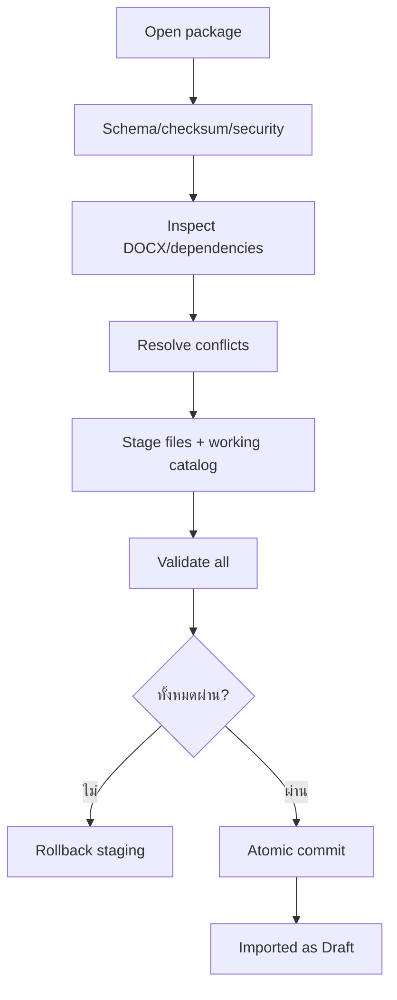

# Phase Handoff — jmoney 2.2 Template Packages

สถานะเริ่มต้น: `Planned`  
รุ่นฐาน: `2.1.0`  
รุ่นเป้าหมาย: `2.2.0`  
Dependency: Large Catalog UX และ validation cache เสร็จ  
วิธีสั่งงานที่แนะนำ: `/goal`

---

## 1. เป้าหมาย

ทำให้ผู้ดูแลส่งออกและนำเข้า “ชุดกระบวนการเอกสาร” ได้ในไฟล์เดียว โดยรวม:

- กลุ่ม
- แม่แบบ DOCX
- Custom Tag definitions
- metadata
- checksums
- documentation

นามสกุลแนะนำ:

```text
.jmoney-template
```

ไฟล์จริงเป็น ZIP ที่มี schema/version ชัดเจน

---

## 2. Package Contract

ตัวอย่าง:

```text
ContractProcess.jmoney-template
├── package.json
├── groups.json
├── tags.json
├── checksums.json
├── README.md
└── templates\
    ├── 01-approval.docx
    ├── 02-scope.docx
    └── 03-contract.docx
```

`package.json` อย่างน้อย:

```json
{
  "schemaVersion": 1,
  "packageId": "stable-guid-or-slug",
  "name": "กระบวนการทำสัญญา",
  "version": "1.0.0",
  "createdAt": "ISO-8601",
  "minimumAppVersion": "2.2.0",
  "groups": [],
  "templates": [],
  "customTagIds": []
}
```

ห้ามเก็บข้อมูลผู้ใช้หรือค่าที่แทน Tag

---

## 3. Scope Required

### 3.1 Export

- export template เดียว
- export ทั้งกลุ่ม
- เลือกว่าจะรวม dependent Custom Tags ใด
- สร้าง checksums
- sanitize filenames
- สร้าง package atomically
- preview manifest ก่อน save
- ไม่รวม System Tag definitions ซ้ำ แต่ประกาศ dependencies

### 3.2 Import Preflight

ก่อน copy:

- validate ZIP structure
- reject path traversal
- limit compressed/uncompressed size
- validate JSON schema
- verify checksums
- verify minimum app version
- inspect DOCX ทุกไฟล์
- validate Custom Tags
- build conflict report

### 3.3 Conflict Resolution

ตรวจ:

- PackageId/version ซ้ำ
- GroupId/name ซ้ำ
- TemplateId/file/display name ซ้ำ
- Custom Tag ID ซ้ำ
- Tag text ซ้ำแต่ definition ต่าง
- System Tag conflict

ตัวเลือก:

```text
Reuse existing
Merge compatible
Import as copy with new IDs
Rename display/file/tag เมื่อปลอดภัย
Skip item
Cancel all
```

การ rename Tag ต้อง rewrite DOCX แบบ safe rename และแสดง impact

### 3.4 Transaction

Import ทำกับ staging directory และ working catalog ก่อน



ห้ามมี partial import เว้นแต่ UI ระบุชัดและ transaction แยกราย item

### 3.5 Lifecycle

- Imported Template เริ่ม Draft
- ห้าม package กำหนด Active บนเครื่องปลายทาง
- ผู้ดูแลต้อง Validate/Trial/Activate
- package signature ในอนาคตไม่ bypass lifecycle

### 3.6 Package Management

- list imported packages
- package ID/version/source
- template/group ownership
- update preview
- uninstall package โดยตรวจ user modifications
- export current modified package เป็นรุ่นใหม่

---

## 4. Security Requirements

- ZIP traversal guard
- entry count/size limit
- duplicate normalized path guard
- reject absolute/UNC path
- checksum before use
- JSON depth/size limit
- file extension allowlist
- no executable/script inside package
- no auto-open README external link
- no network fetch during import
- imported DOCX is untrusted until validated

---

## 5. Non-Goals

- ยังไม่ทำ online marketplace
- ยังไม่ดาวน์โหลด package จาก URL
- ยังไม่ทำ account/publisher trust service
- ยังไม่ทำ cloud sync
- ยังไม่ให้ package รัน code/plugin
- ยังไม่ย้าย architecture 3.0

---

## 6. Source Area ที่คาดว่าจะเปลี่ยน

- package domain models/schema
- package export/import services
- conflict resolution dialogs
- Admin Center package page
- DOCX safe rename/rewrite
- atomic file/catalog transaction
- validation cache invalidation
- installer/source packaging docs
- tests/fixtures

ควรแยก package logic เป็น service ใหม่ ไม่เพิ่มทั้งหมดลง MainForm/Admin dialog

---

## 7. Implementation Sequence

1. ADR + schema v1
2. package reader/writer
3. checksum/security validation
4. export template/group
5. import preflight
6. conflict model
7. conflict UI
8. staged atomic import
9. package ownership/update/remove
10. lifecycle integration
11. tests/fixtures
12. migration/docs/release

---

## 8. Acceptance Criteria

- export กลุ่ม 11 เอกสารแล้ว import อีกเครื่องได้
- System Tag dependency ถูกตรวจ
- Custom Tag definitions ครบ
- package checksum mismatch ถูก block
- traversal/oversize/executable entry ถูก block
- conflict ทุกชนิดมี deterministic resolution
- cancel ไม่ทิ้งไฟล์/catalog/tag
- imported templates เป็น Draft
- activate ต้อง trial render
- package update ไม่เขียนทับ user-modified template แบบเงียบ
- export/import round-trip รักษา metadata/tag/document hashes ตาม contract
- 2.1 search/cache ทำงานหลัง import
- upgrade 2.1 → 2.2 รักษา catalog เดิม

---

## 9. Tests ที่ต้องเพิ่ม

- valid single/group package
- round-trip
- missing manifest/checksum/file
- corrupted JSON/DOCX
- traversal and normalized duplicate path
- zip bomb limits
- System Tag dependency missing
- compatible/incompatible Custom Tag collision
- Group/Template ID collision
- rename rewrite in header/footer/split run
- cancel/exception rollback
- package update with local modifications
- remove package with dependent templates/tags

---

## 10. Migration & Rollback

Catalog อาจเพิ่ม:

- package source metadata
- package ID/version
- local modification fingerprint

Migration:

- existing templates มี package source ว่าง
- existing user templates ไม่ถูกถือว่า package-owned
- backup catalog ก่อน schema bump

Rollback:

- import failure ลบ staging
- atomic commit failure คืน catalog/files
- package feature disable แล้วระบบเดิมยังใช้ template ที่ commit สำเร็จได้

---

## 11. Prompt สำหรับ Chat ก่อน Goal

```text
อ่าน README.md, Handof6steps/README.md,
Handof6steps/STEP-03-HANDOFF-2.2-TEMPLATE-PACKAGES.md และ
TEMPLATE_AND_TAG_SPEC_TH.md ให้ครบ

ยังไม่แก้ไฟล์ ให้ทำ architecture/design review:
- เสนอ .jmoney-template schema v1
- ระบุ stable IDs, ownership และ version semantics
- สร้าง conflict matrix ทุกชนิด
- ออกแบบ staged atomic import/rollback
- threat model ZIP/JSON/DOCX package
- ออกแบบ round-trip and migration tests
- ระบุ interaction กับ validation cache และ lifecycle

ผลลัพธ์ต้องมี ADR, schema example, state machine,
conflict-resolution table, security controls, file impact และ test matrix
ห้าม build, commit หรือ push
```

---

## 12. /goal พร้อมใช้

```text
/goal พัฒนา jmoney 2.2.0 ตาม Handof6steps/STEP-03-HANDOFF-2.2-TEMPLATE-PACKAGES.md บนฐาน 2.1.0: สร้าง .jmoney-template schema v1 สำหรับ export/import template เดียวหรือทั้งกลุ่มพร้อม Custom Tag dependencies, metadata, version และ checksums เพิ่ม secure package reader/writer, size/path/entry/schema guards, preflight DOCX inspection, deterministic conflict resolution, safe tag rename, staging + atomic commit + full rollback, package ownership/update/remove และบังคับ imported templates เป็น Draft ก่อน Validate/Trial/Active รักษา Search/Filter/cache, offline/local-first, System Tag locks, user data/output/User Templates และ upgrade safety ห้าม online marketplace, URL download, cloud sync, account หรือ executable plugin เพิ่ม security/round-trip/conflict/migration/rollback tests รันทุก tests จนผ่าน อัปเดต schema/version/docs/changelog/packages/checksum และ Checkpoint เสร็จเมื่อ export 11-document group แล้ว import บน clean/upgraded workspace ได้โดยไม่มี partial state และทุก security/upgrade test ผ่าน ห้าม commit/push จนเจ้าของสั่ง
```

---

## 13. Checkpoint ล่าสุด

- วันที่: 2026-07-29
- Base release: 2.1.0 (ต้องเสร็จก่อน)
- สถานะ: Planned
- งานที่เสร็จ: Package contract ระดับ roadmap
- งานที่เหลือ: ADR/schema/implementation/tests ทั้งหมด
- Blocker: รอ Phase 2.1
- คำสั่งเริ่มต่อ: ใช้ Chat prompt ทำ ADR ก่อน แล้วเริ่ม `/goal`

