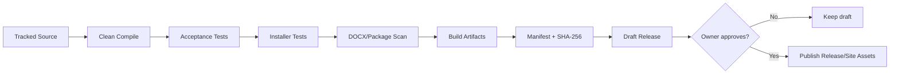

# Phase Handoff — jmoney 2.3 Professional Release

สถานะเริ่มต้น: `Planned`  
รุ่นฐาน: `2.2.0`  
รุ่นเป้าหมาย: `2.3.0`  
Dependency: Template Package schema/tests เสถียร  
วิธีสั่งงานที่แนะนำ: `/goal`

---

## 1. เป้าหมาย

เปลี่ยนกระบวนการพัฒนาและเผยแพร่จากการดูแล source workspace/ZIP ด้วยมือ ให้เป็น repository และ release pipeline ที่ตรวจสอบย้อนกลับและสร้างซ้ำได้

ผลลัพธ์หลัก:

- source code ถูก track รายไฟล์ใน Git
- Source ZIP เป็น build artifact ไม่ใช่ source of truth
- GitHub Actions compile/test/package ได้
- version มี source of truth เดียว
- release checksum สร้างอัตโนมัติ
- installer มี metadata มาตรฐานและพร้อมสำหรับ signing
- release ทุกชิ้นผูกกับ commit/tag

---

## 2. Current Problem

ก่อน Phase นี้ repository หลักเน้นเว็บไซต์และ binary downloads:

```text
assets/downloads/ReimbursementDocApp-Source.zip
assets/downloads/ReimbursementDocApp-Installer.zip
```

source workspace ถูก ignore จึง:

- review C# diff บน GitHub ไม่ได้
- CI build จาก tracked source ไม่ได้
- Source ZIP อาจไม่ตรงกับ commit โดยตรวจยาก
- หลายเครื่องต้องแตก ZIP ก่อนเริ่มงาน
- merge/branch source code ไม่สะดวก

---

## 3. Target Repository Layout

โครงแนะนำโดยยังไม่ refactor domain ใหญ่:

```text
jmoney\
├── src\
│   └── ReimbursementDocApp\
│       ├── ReimbursementDocApp.cs
│       ├── TemplateCatalog.cs
│       ├── TemplateAdminCenter.cs
│       ├── DocumentTemplateDialogs.cs
│       ├── Installer.cs
│       └── Uninstaller.cs
├── tests\
│   ├── GoalAcceptanceTest.cs
│   ├── InstallerUpgradeTest.cs
│   └── fixtures\
├── templates\
│   └── built-in\
├── config\
│   ├── app_database.json
│   ├── template_catalog.json
│   └── template_tags.json
├── packaging\
│   ├── build-exe.ps1
│   ├── build-installer.ps1
│   └── ...
├── docs\
│   └── roadmap\
├── assets\
│   └── downloads\
├── VERSION.txt
├── README.md
└── CHANGELOG.md
```

ชื่อจริงปรับได้ แต่ต้องแยก tracked source/tests/templates/packaging ชัด

---

## 4. Scope Required

### 4.1 Source Migration

- extract release source ที่ยืนยัน hash แล้ว
- compare กับ local workspace
- เลือก canonical source
- move เข้า tracked directories
- ปรับ build/test scripts เป็น path ใหม่
- update `.gitignore`
- ห้าม track build output, saved data, output หรือ backups
- verify source package จาก tracked files เท่านั้น

สร้าง migration manifest:

```text
old path -> new path
included/excluded reason
hash before/after for binary templates/config
```

### 4.2 Version Source of Truth

เลือก `VERSION.txt` หรือ build metadata file หนึ่งจุด

Build ต้อง derive:

- AssemblyVersion/FileVersion/ProductVersion
- Installer version
- package metadata
- README/release metadata ที่ตรวจได้

CI ต้อง fail หาก version mismatch

ใช้ SemVer:

```text
MAJOR.MINOR.PATCH
```

### 4.3 GitHub Actions CI

Pull/push checks:

1. validate repository structure
2. compile
3. run acceptance tests
4. run installer tests
5. validate built-in templates
6. scan forbidden package content
7. verify no leftover tags
8. verify docs links/checksums policy

Release tag workflow:

1. checkout exact tag
2. compile clean
3. test
4. build Installer ZIP
5. build Source ZIP
6. generate SHA256SUMS
7. archive test report
8. create draft GitHub Release

ห้าม auto-deploy/publish release จาก unreviewed branch

### 4.4 Reproducibility

- clean build directory
- deterministic file allowlist
- stable version input
- document compiler/tool versions
- package manifest listing every entry
- compare clean-machine output structure

Binary hash อาจไม่ deterministic หาก compiler timestamp ต่าง แต่ content source/tag/manifest ต้อง trace ได้

### 4.5 Installer ADR

ประเมิน:

| Option | จุดแข็ง | ข้อแลกเปลี่ยน |
|---|---|---|
| Current custom installer | ควบคุมง่าย, dependency ต่ำ | Windows metadata/repair/signing workflow จำกัด |
| Inno Setup | mature, Apps & Features, script ง่าย | เพิ่ม tool dependency |
| WiX | MSI มาตรฐานองค์กร | complexity สูง |
| MSIX | modern Windows deployment | signing/compatibility constraints |

ตัดสินด้วย ADR ก่อนย้าย

Required installer outcome:

- Apps & Features metadata
- product/publisher/version/icon
- upgrade detection
- uninstall entry
- user-level install หรือ privilege policy ชัด
- preserve data contract เดิม
- repair/reinstall behavior ชัด

### 4.6 Code Signing Readiness

Phase นี้ต้อง:

- แยก signing step จาก build
- รองรับ unsigned development build
- document certificate/secret handling
- CI ห้ามพิมพ์ secret
- verify signature เมื่อมี certificate
- README อธิบาย signed/unsigned channel

ไม่ต้องซื้อ certificate โดยอัตโนมัติ การเลือกผู้ให้บริการเป็น owner decision

### 4.7 Release Governance

- release checklist เป็น machine-checkable เท่าที่ทำได้
- changelog per version
- release notes
- artifact hashes
- retention/legacy policy
- rollback asset
- hotfix numbering

---

## 5. CI Flow



---

## 6. Non-Goals

- ยังไม่ refactor MainForm/Admin/Domain ใหญ่
- ยังไม่เปลี่ยน JSON เป็น database
- ยังไม่ทำ microservices
- ยังไม่ทำ organization/multi-user mode
- ยังไม่บังคับซื้อ signing certificate
- ยังไม่ auto-update แอปโดยไม่มี design/consent

---

## 7. Implementation Sequence

1. inventory/hash source workspace และ ZIP
2. ADR repository layout
3. migrate tracked source/tests/templates/config
4. fix local build/test paths
5. make clean package from tracked source
6. version source of truth
7. CI checks
8. release workflow แบบ draft
9. installer ADR/implementation
10. signing-ready step
11. clean-machine validation
12. docs/migration/release

Source migration ควรเป็น commit ที่ review ได้แยกจาก installer technology change

---

## 8. Acceptance Criteria

- clone ใหม่แล้ว build/test ได้โดยไม่แตก Source ZIP
- tracked source ตรงกับ release source ที่ยืนยันแล้ว
- no user data/build output tracked
- CI ผ่านบน main/PR
- CI fail เมื่อ test/package/version/checksum policy ผิด
- tagged clean build สร้าง Installer/Source/manifest/checksum
- artifact entry list ตรง allowlist
- GitHub Release เริ่มเป็น draft
- installer fresh/upgrade/uninstall ผ่าน
- Apps & Features metadata ถูกต้องเมื่อเลือก installer ใหม่
- unsigned/signed build path แยกชัด
- rollback ไป release 2.2 ได้

---

## 9. Tests/Checks ที่ต้องเพิ่ม

- clean clone bootstrap
- source ZIP content equals tracked allowlist
- version mismatch gate
- forbidden files gate
- built-in template hash/tag checks
- release tag/version match
- installer registration/unregistration
- repair/reinstall
- upgrade 2.0/2.1/2.2 → 2.3
- signing step skipped safely without secret
- signing verification เมื่อ secret/cert มี

---

## 10. Migration & Rollback

Migration source:

- ห้ามลบ release ZIP เดิมก่อน clean build ผ่าน
- เก็บ source ZIP 2.2 เป็น baseline
- compare binary templates/config hashes
- migration commit ต้องไม่มี feature behavior changeโดยไม่ระบุ

Rollback:

- source layout rollback ผ่าน Git
- release assets 2.2 อยู่ legacy/release
- installer ใหม่ต้องไม่ทำลายข้อมูลจนใช้ installer เดิมย้อนกลับไม่ได้

---

## 11. Prompt สำหรับ Chat ก่อน Goal

```text
อ่าน README.md, ROADMAP_HANDOFF_TH.md และ
docs/roadmap/PHASE-2.3-PROFESSIONAL-RELEASE.md ให้ครบ

ทำ discovery/ADR โดยยังไม่แก้ไฟล์:
- inventory tracked repo, Source ZIP และ local source workspace
- เปรียบเทียบ source/config/template hashes
- เสนอ target repository layout และ migration map
- วิเคราะห์ current build/compiler/installer dependencies
- เปรียบเทียบ current installer, Inno Setup, WiX และ MSIX
- ออกแบบ CI + draft release workflow
- ออกแบบ single version source และ package allowlist
- ระบุ secrets/signing boundary

ผลลัพธ์ต้องมี ADRs, migration sequence, rollback,
CI job matrix, installer decision matrix และ acceptance checklist
ห้าม commit/push หรือเปลี่ยน release assets
```

---

## 12. /goal พร้อมใช้

```text
/goal พัฒนา jmoney 2.3.0 ตาม docs/roadmap/PHASE-2.3-PROFESSIONAL-RELEASE.md บนฐาน 2.2.0: ย้าย canonical source/tests/built-in templates/config/build scripts มาเป็น tracked files ใน repository ด้วย migration/hash manifest, ปรับ clean clone build/test/package, ทำ version source of truth เดียว, GitHub Actions สำหรับ compile+tests+DOCX/package/version gates และ tag workflow ที่สร้าง draft release พร้อม Installer/Source/manifests/SHA-256 จาก tracked source เท่านั้น ทำ Installer ADR แล้วปรับ installer ให้มี Apps & Features metadata, upgrade/uninstall/repair contract และ signing-ready step โดยรักษาข้อมูลผู้ใช้/output/User Templates/catalog/package/lifecycle และ rollback assets ห้าม refactor architecture 3.0, database, cloud หรือ organization mode แยก source migration จาก behavior changes เพิ่ม clean-clone/CI/version/package/installer/signing tests อัปเดต docs/changelog/checksum/Checkpoint เสร็จเมื่อ clone ใหม่ build 65+ tests และ release artifacts ได้, CI gates failure ได้จริง, upgrade หลายรุ่นผ่าน และ draft release trace ถึง commit/tag ห้าม publish release, commit หรือ push จนเจ้าของสั่งแต่ละ action ชัดเจน
```

---

## 13. Checkpoint ล่าสุด

- วันที่: 2026-07-29
- Base release: 2.2.0 (ต้องเสร็จก่อน)
- สถานะ: Planned
- งานที่เสร็จ: Target outcomes และ migration constraints
- งานที่เหลือ: ADR/inventory/migration/CI/installer ทั้งหมด
- Blocker: รอ 2.2 และ owner decision เรื่อง installer/signing
- คำสั่งเริ่มต่อ: ใช้ Chat prompt ทำ ADR ก่อน `/goal`

