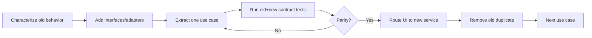

# Phase Handoff — jmoney 3.0 Modular Architecture

สถานะเริ่มต้น: `Planned`  
รุ่นฐาน: `2.3.x`  
รุ่นเป้าหมาย: `3.0.0`  
Dependency: source tracked, CI/release pipeline เสถียร  
วิธีสั่งงานที่แนะนำ: `/goal` แบบ checkpointed

---

## 1. เป้าหมาย

ลด coupling และ class ขนาดใหญ่ โดยแยก Presentation, Application, Domain และ Infrastructure ภายใน desktop modular monolith

ไม่เปลี่ยน product behavior โดยไม่จำเป็น แต่เตรียมฐานสำหรับ:

- business rule ใหม่
- Tag schema evolution
- UI ใหม่
- storage implementation ใหม่
- unit/integration testing
- contributor/Codex เข้าใจขอบเขตง่ายขึ้น

---

## 2. Current Structural Pressure

Baseline โดยประมาณก่อน Roadmap:

```text
ReimbursementDocApp.cs      ~2,915 lines
TemplateAdminCenter.cs      ~1,148 lines
DocumentTemplateDialogs.cs  ~1,037 lines
TemplateCatalog.cs            ~909 lines
```

ปัญหาหลัก:

- UI รู้เรื่อง catalog/render/business rules มาก
- static methods และ file paths ทำ test isolation ยาก
- dialog/service/domain responsibilities ปะปน
- refactor จุดหนึ่งเสี่ยงกระทบ generation/upgrade
- Tag identity ผูกกับ placeholder text

---

## 3. Target Architecture

```text
Presentation
├── MainForm
├── AdminCenter
├── TemplateDialogs
├── DynamicFieldControls
└── ViewModels/Presenters

Application
├── DocumentGenerationService
├── TemplateImportService
├── TemplateValidationService
├── TemplatePackageService
├── TagManagementService
├── CatalogMigrationService
├── BackupService
└── DiagnosticService

Domain
├── DocumentGroup
├── DocumentTemplate
├── TagDefinition
├── TemplateLifecycle
├── ValidationResult
├── PackageIdentity
└── DomainRules

Infrastructure
├── JsonCatalogRepository
├── DocxRenderer
├── DocxInspector
├── AtomicFileStore
├── FileBackupStore
├── PackageArchiveStore
└── LocalLogger
```

ยัง build/deploy เป็น desktop app ชุดเดียว

---

## 4. Architecture Rules

- Presentation เรียก Application interfaces
- Application orchestrates use cases
- Domain ไม่อ้าง WinForms, file system, JSON หรือ XML
- Infrastructure implement ports/interfaces
- UI ห้ามเขียน catalog/DOCX โดยตรง
- Domain identity ใช้ stable IDs
- file paths resolve ผ่าน base/application context ที่ validate แล้ว
- transaction boundary อยู่ Application/Infrastructure ไม่อยู่ event handler

---

## 5. Scope Required

### 5.1 Characterization Tests First

ก่อนย้าย code:

- capture current generation outputs
- catalog migrations
- template lifecycle
- tag rename
- backup/restore
- installer preservation
- search/cache/package behavior

ใช้ golden/contract tests โดยไม่ผูกกับ volatile timestamp

### 5.2 Extract Domain Models

ย้าย model/value rules:

- group/template/tag
- lifecycle transition
- validation result
- stable identities
- package metadata

Domain object ต้อง validate invariant ได้โดยไม่เปิดไฟล์

### 5.3 Extract Infrastructure

- JSON repository
- atomic store
- backup store
- DOCX inspector/renderer
- logger
- package archive

เพิ่ม interfaces ที่จำเป็นจริง ไม่สร้าง abstraction ทุก class

### 5.4 Extract Application Services

Use cases:

- load/startup health
- import template
- validate template
- activate template
- rename/remove tag
- generate documents
- export/import package
- backup/restore

แต่ละ service มี explicit input/output/error contract

### 5.5 Thin Presentation

Event handler ควร:

1. read UI input
2. call use case
3. render result/error

ห้าม:

- manipulate ZIP/XML
- save JSON
- decide lifecycle transition
- move recovery files

### 5.6 Stable Tag Identity

แยก:

```text
Stable ID: contractor.title
Placeholder: {คำนำหน้าลูกจ้าง}
Display Name: คำนำหน้าผู้รับจ้าง
Aliases: {คำนำหน้าชื่อ}
```

ต้องออกแบบ migration:

- System Tag เดิม → stable ID
- Custom Tag เดิม → generated stable ID
- placeholder ยังทำงาน
- aliases มี canonical mapping
- package/export ใช้ stable ID

ห้าม rename DOCX ทั้งหมดใน migration หากไม่จำเป็น

### 5.7 Schema Migration Framework

- numbered schema migrations
- forward migration
- backup before migration
- idempotency
- read-back verification
- unsupported future schema fails safely
- rollback strategy หรือ restore backup

### 5.8 Dependency Composition

สร้าง composition root ที่ประกอบ:

- repositories
- services
- validators
- UI

หลีกเลี่ยง global/static state ใหม่

---

## 6. Migration Strategy

ใช้ incremental/strangler ภายใน monolith:



ลำดับ extraction แนะนำ:

1. logging/diagnostics
2. backup/atomic store
3. catalog repository/migrations
4. DOCX inspector
5. DOCX renderer
6. template validation/activation
7. import/package
8. tag management
9. document generation orchestration
10. presentation cleanup

---

## 7. Non-Goals

- ไม่ทำ microservices
- ไม่ทำ server/cloud
- ไม่ rewrite UI framework พร้อม architecture migration
- ไม่ย้าย database พร้อมกัน
- ไม่เปลี่ยน DOCX format
- ไม่เพิ่ม arbitrary user scripting
- ไม่ทำ feature ใหม่ขนาดใหญ่ระหว่าง parity refactor

---

## 8. Acceptance Criteria

- UI behavior หลัก parity กับ 2.3
- original/generated DOCX contract tests ผ่าน
- no leftover tags
- lifecycle/package/search/cache/diagnostic behavior ผ่าน
- UI event handlers ไม่มี file/JSON/ZIP/XML transaction logic
- Domain project/namespace ไม่อ้าง WinForms/System.IO serialization
- services test ได้ด้วย temp/in-memory adapters
- schema migration จาก 2.0–2.3 fixtures ผ่าน
- future schema ถูก block safely
- upgrade installer รักษาข้อมูล
- performance ไม่แย่กว่า baseline ที่กำหนด
- clean clone CI/release ผ่าน

---

## 9. Tests ที่ต้องเพิ่ม

- architecture dependency rule tests/checks
- domain invariant tests
- service use-case tests
- repository failure/rollback
- migration version matrix
- renderer/inspector contract
- UI smoke tests สำหรับ critical flows
- golden outputs normalized
- package/search/cache integration
- performance baseline comparison

---

## 10. Risk Controls

| Risk | Control |
|---|---|
| Big-bang rewrite | extract ทีละ use case |
| behavior drift | characterization/golden tests |
| over-abstraction | interface เฉพาะ boundary ที่ต้อง fake/swap |
| version migration damage | fixtures + backup + idempotency |
| Tag mapping error | explicit ID/placeholder/alias table |
| long-running branch | small green commits/checkpoints |

---

## 11. Rollback

- ทุก extraction ต้องสามารถ route กลับ old implementation ชั่วคราว
- migration backup ก่อนเขียน schema
- ไม่ลบ old path จน parity tests ผ่าน
- release 2.3 artifacts/installer อยู่ครบ
- หาก 3.0 upgrade fail ให้ 2.3 เปิด backup catalog ได้ตาม documented path

---

## 12. Prompt สำหรับ Chat ก่อน Goal

```text
อ่าน README.md, ROADMAP_HANDOFF_TH.md และ
docs/roadmap/PHASE-3.0-MODULAR-ARCHITECTURE.md ให้ครบ

ทำ architecture assessment ของ source 2.3.x โดยยังไม่แก้:
- map UI/application/domain/infrastructure responsibilities ปัจจุบัน
- สร้าง method/class dependency map
- ระบุ transaction boundaries และ global/static state
- เสนอ target projects/namespaces/interfaces
- วาง characterization tests ก่อน extraction
- ออกแบบ stable Tag ID + alias migration
- วาง incremental extraction checkpoints และ rollback

ห้ามเสนอ microservices, cloud, database migration หรือ UI rewrite
ผลลัพธ์ต้องมี ADR, dependency diagram, extraction order,
migration matrix, parity gates และ file move map
ห้าม commit/push
```

---

## 13. /goal พร้อมใช้

```text
/goal พัฒนา jmoney 3.0.0 ตาม docs/roadmap/PHASE-3.0-MODULAR-ARCHITECTURE.md จากฐาน 2.3.x ด้วย incremental modular-monolith refactor: สร้าง characterization/golden tests ก่อน, แยก Presentation/Application/Domain/Infrastructure, extract atomic store/backup/catalog repository+migrations/DOCX inspector+renderer/template lifecycle/tag/package/generation services ทีละ use case, ทำ UI event handlers ให้บาง, เพิ่ม composition root, stable Tag IDs แยกจาก placeholder/display/aliases และ numbered idempotent schema migration ที่ backup/verify/fail-safe รักษา behavior/layout/font/spacing/Header/Footer/split runs, offline data, search/cache/packages/diagnostics, saved data/output/User Templates และ installer upgrades ห้าม big-bang rewrite, microservices, cloud, database migration, UI framework rewrite หรือ feature ใหญ่ใหม่ ใช้ parity gate และ rollback ทุก checkpoint รัน domain/service/integration/UI smoke/migration/performance/CI/release tests อัปเดต version/docs/changelog/packages/checksum/Checkpoint เสร็จเมื่อ dependency rules ผ่าน, critical UI/DOCX behavior parity, migration fixtures 2.0–2.3 ผ่าน, clean release ผ่าน และไม่มี required scope เหลือ ห้าม commit/push จนเจ้าของสั่ง
```

แนะนำให้ Goal นี้ทำเป็น checkpoints ไม่ควรรอ commit เดียวตอนจบ

---

## 14. Checkpoint ล่าสุด

- วันที่: 2026-07-29
- Base release: 2.3.x (ต้องเสร็จก่อน)
- สถานะ: Planned
- งานที่เสร็จ: Target architecture และ extraction order ระดับ roadmap
- งานที่เหลือ: Assessment/characterization/refactor/migration ทั้งหมด
- Blocker: รอ source tracking + CI จาก 2.3
- คำสั่งเริ่มต่อ: ใช้ Chat assessment ก่อนสร้าง Goal

