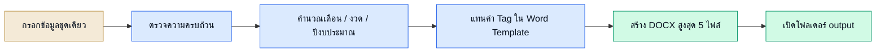
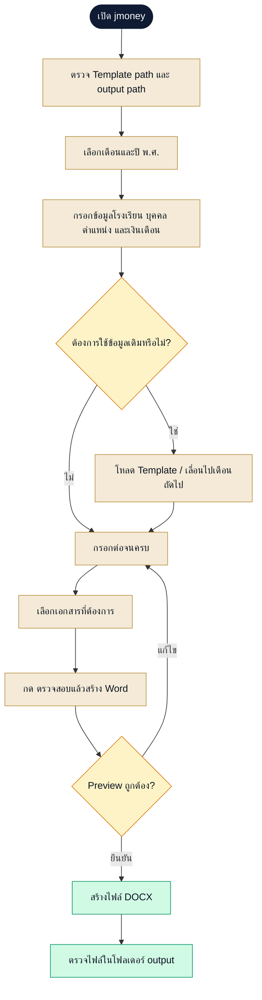
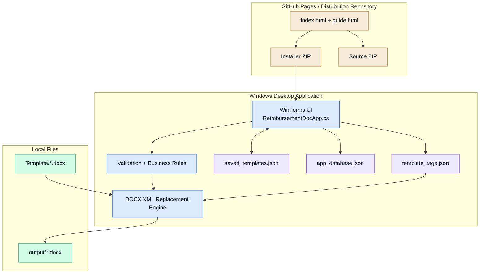
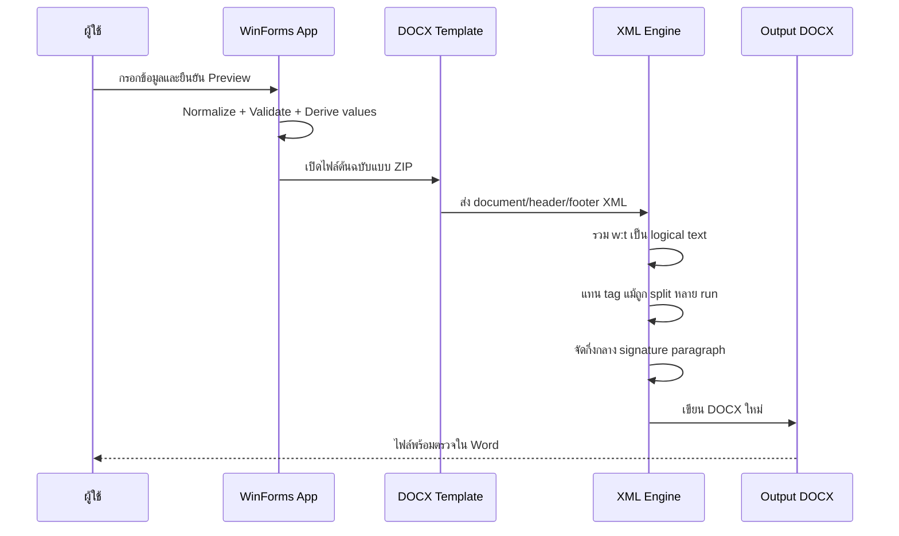
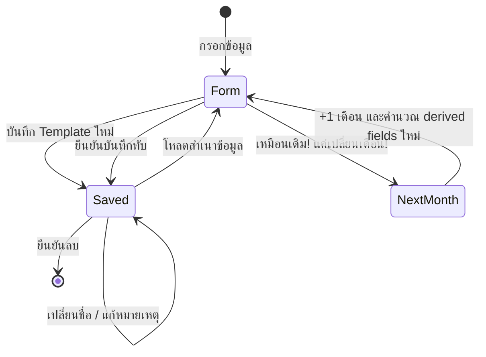
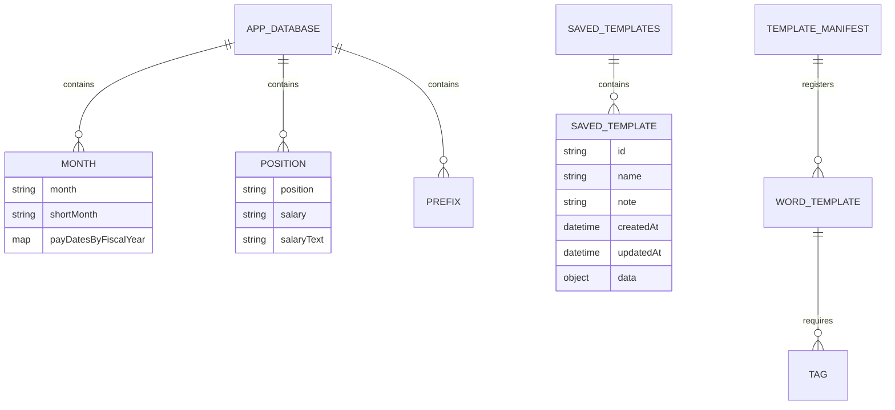

<div align="center">


# jmoney

### โปรแกรมสร้างเอกสารเบิกจ่าย Word แบบออฟไลน์สำหรับ Windows

กรอกข้อมูลเพียงครั้งเดียว แล้วสร้างเอกสารราชการจาก Word Template ได้สูงสุด 5 ฉบับ<br>
ข้อมูลทั้งหมดประมวลผลและจัดเก็บอยู่ในเครื่องของผู้ใช้

[](https://robbygrean.github.io/jmoney/)
[](./assets/downloads/ReimbursementDocApp-Installer.zip)
[](./guide.html)
[](./assets/downloads/ReimbursementDocApp-Source.zip)


</div>

> [!IMPORTANT]
> jmoney เป็น **Desktop app แบบออฟไลน์** ไม่ใช่เว็บแอป หน้าเว็บไซต์นี้มีหน้าที่แจกโปรแกรม คู่มือ และชุด source สำหรับศึกษาเท่านั้น ข้อมูลบุคคลและเอกสารไม่ได้ถูกอัปโหลดขึ้นเว็บไซต์

---

## สารบัญ

- [jmoney คืออะไร](#jmoney-คืออะไร)
- [ดาวน์โหลดและติดตั้ง](#ดาวน์โหลดและติดตั้ง)
- [ความสามารถทั้งหมด](#ความสามารถทั้งหมด)
- [เอกสารที่สร้างได้](#เอกสารที่สร้างได้)
- [วิธีใช้งาน](#วิธีใช้งาน)
- [หลักคิดสำคัญของระบบ](#หลักคิดสำคัญของระบบ)
- [สถาปัตยกรรม](#สถาปัตยกรรม)
- [กฎทางธุรกิจ](#กฎทางธุรกิจ)
- [ระบบ Word Template และ Tag](#ระบบ-word-template-และ-tag)
- [ระบบ Template ข้อมูลเดิม](#ระบบ-template-ข้อมูลเดิม)
- [โครงสร้างข้อมูล](#โครงสร้างข้อมูล)
- [โครงสร้าง repository](#โครงสร้าง-repository)
- [สำหรับนักพัฒนา](#สำหรับนักพัฒนา)
- [ความปลอดภัยและข้อจำกัด](#ความปลอดภัยและข้อจำกัด)

---

## jmoney คืออะไร

jmoney หรือ `ReimbursementDocApp` ช่วยลดการกรอกข้อมูลซ้ำในการทำเอกสารเบิกจ่ายค่าจ้างของโรงเรียน ผู้ใช้กรอกข้อมูลบุคคล โรงเรียน ตำแหน่ง เงินเดือน เดือน และปีงบประมาณในฟอร์มเดียว จากนั้นโปรแกรมจะนำข้อมูลไปแทน `{tag}` ในไฟล์ Word ต้นฉบับและสร้างเอกสารพร้อมใช้งาน

| เหมาะสำหรับ | สิ่งที่ได้รับ |
|---|---|
| ผู้ใช้ทั่วไป / ธุรการโรงเรียน | โปรแกรมติดตั้งบน Windows และคู่มือภาษาไทย |
| ผู้ทำเอกสารเบิกจ่ายรายเดือน | ระบบจำข้อมูลเดิม โหลดกลับ และเลื่อนไปเดือนถัดไป |
| นักพัฒนา / ผู้เรียนรู้ | source code, build scripts, DOCX engine และเอกสาร handoff |
| ผู้สร้างระบบเอกสารอื่น | ตัวอย่างสถาปัตยกรรม Word Template + JSON + Desktop UI |

### ภาพรวมใน 30 วินาที



---

## ดาวน์โหลดและติดตั้ง

### ไฟล์สำหรับผู้ใช้ทั่วไป

1. ดาวน์โหลด [`ReimbursementDocApp-Installer.zip`](./assets/downloads/ReimbursementDocApp-Installer.zip)
2. แตกไฟล์ ZIP ก่อนใช้งาน
3. เปิด `ReimbursementDocApp-Setup.exe`
4. เมื่อติดตั้งเสร็จ โปรแกรมจะเปิดอัตโนมัติและสร้าง shortcut ที่ Desktop กับ Start Menu

ตำแหน่งติดตั้ง:

```text
%LOCALAPPDATA%\ReimbursementDocApp
```

โครงสร้างหลังติดตั้ง:

```text
ReimbursementDocApp\
├── ReimbursementDocApp.exe
├── Uninstall ReimbursementDocApp.exe
├── app_database.json
├── template_tags.json
├── saved_templates.json          # เกิดขึ้นเมื่อบันทึก Template ข้อมูลครั้งแรก
├── Template\                     # Word Template 5 ฉบับ
└── output\                       # เอกสารที่สร้างเสร็จ
```

> [!WARNING]
> โปรแกรมยังไม่ได้ลงนามด้วย Code Signing Certificate จึงอาจพบคำเตือนจาก Chrome หรือ Windows SmartScreen ตรวจสอบว่าดาวน์โหลดจาก repository/เว็บไซต์นี้และชื่อไฟล์ตรงกันก่อนเสมอ หาก Windows แสดงหน้าฟ้า ให้เลือก `More info` แล้ว `Run anyway` เฉพาะเมื่อคุณตรวจสอบแหล่งที่มาแล้ว

### ตรวจสอบความถูกต้องของไฟล์

```powershell
Get-FileHash .\ReimbursementDocApp-Installer.zip -Algorithm SHA256
```

| ไฟล์ | ขนาดโดยประมาณ | SHA-256 |
|---|---:|---|
| `ReimbursementDocApp-Installer.zip` | 508 KB | `E1CFD72C00D6832C8B03E63E0CA210D036EC44AD66C407315948CEC6058058C3` |
| `ReimbursementDocApp-Source.zip` | 6.76 MB | `94F3E57D27A7F4ED108DC8507D431C3EAC34942D9F4DFA87E6ADA42180F692EF` |

อ่านวิธีติดตั้งแบบละเอียดได้ที่ [คู่มือบนเว็บไซต์](./guide.html) หรือ [คู่มือข้อความ](./assets/downloads/README-%E0%B8%81%E0%B8%B2%E0%B8%A3%E0%B8%A5%E0%B8%87%E0%B9%82%E0%B8%9B%E0%B8%A3%E0%B9%81%E0%B8%81%E0%B8%A3%E0%B8%A1%E0%B9%81%E0%B8%A5%E0%B8%B0%E0%B8%81%E0%B8%B2%E0%B8%A3%E0%B9%83%E0%B8%8A%E0%B9%89%E0%B8%87%E0%B8%B2%E0%B8%99.txt)

---

## ความสามารถทั้งหมด

### การกรอกและจัดการข้อมูล

- แบ่งฟอร์มเป็นหมวดข้อมูลหลัก บุคคล การเงิน และข้อมูลอื่น เพื่อลดความสับสน
- เลือกโฟลเดอร์ Word Template และโฟลเดอร์ output ได้
- เลือกสร้างเอกสารทั้งหมดหรือเฉพาะบางฉบับได้ อย่างน้อย 1 รายการ
- เลือกคำนำหน้าชื่อจากรายการที่จัดลำดับเพื่อค้นหาได้ง่าย
- เลือกตำแหน่งงานและเติมเงินเดือน/เงินเดือนตัวอักษรให้อัตโนมัติ
- รองรับข้อมูล ผอ. เจ้าหน้าที่พัสดุ หัวหน้าเจ้าหน้าที่พัสดุ การเงิน กรรมการ และผู้รับจ้าง
- เปิด/ปิดข้อมูลหัวหน้าการเงินซึ่งเป็นส่วน optional ได้
- ปรับชื่อโรงเรียนให้อยู่ในรูป `โรงเรียน...` และป้องกันคำซ้ำ `โรงเรียนโรงเรียน...`

### เดือน วันที่ และปีงบประมาณ

- รองรับเดือนภาษาไทยครบ 12 เดือน
- คำนวณงวดที่ 1–12 ตามปีงบประมาณไทย
- คำนวณปีงบประมาณจากเดือนและปี พ.ศ. ที่เลือก
- สร้างชื่อเดือนแบบเต็ม/ย่อและปีใบสั่งจ้างอัตโนมัติ
- ค้นหา `วันที่ส่งเบิก` จากฐานข้อมูลตามปีงบประมาณ โดยไม่เดาวันราชการเอง
- รับวันที่หลายรูปแบบและแปลงเป็นวันที่ภาษาไทย
- ใช้ dropdown แยกวัน/เดือน/ปีสำหรับวันที่สั่งจ้าง

### การตรวจสอบก่อนสร้างเอกสาร

- ตรวจช่องบังคับและทำเครื่องหมายช่องที่ยังว่าง
- ตรวจว่ามีโฟลเดอร์ Template และไฟล์ต้นฉบับจริง
- แสดง preview สรุปเดือน ปีงบประมาณ จำนวนเอกสาร และปลายทาง
- ให้ผู้ใช้ยืนยันก่อนเริ่มสร้างไฟล์
- แสดงสถานะระหว่างประมวลผลและจำนวนไฟล์เมื่อเสร็จ
- ถามว่าจะเปิดโฟลเดอร์ output หลังสร้างเสร็จหรือไม่

### การสร้าง Word

- สร้างเอกสาร `.docx` จาก layout ต้นฉบับโดยไม่วาดหน้ากระดาษใหม่
- แทน tag ใน body, header และ footer
- รองรับ tag ที่ Microsoft Word แยกออกเป็นหลาย XML run
- คงข้อความรอบ tag และรักษา whitespace
- จัดกึ่งกลางย่อหน้าที่เกี่ยวกับชื่อ/ตำแหน่งใต้ลายเซ็นตามกฎของโปรแกรม
- เติม alias ของ tag บางชื่อเพื่อรองรับ Template ที่สะกดต่างกัน
- ตั้งชื่อไฟล์ภาษาไทยแบบอ่านง่าย
- ไม่เขียนทับไฟล์เดิมแบบเงียบ ๆ แต่ต่อท้าย `_2`, `_3`, ...

### การใช้ข้อมูลเดิมซ้ำ

- บันทึกข้อมูลปัจจุบันเป็น Template ใหม่
- บันทึกทับ Template เดิมโดยยืนยันก่อน
- โหลดข้อมูลเดิมกลับมาแก้ไขต่อได้ โดยไม่ผูกข้อมูลสดกับต้นฉบับ
- ปุ่ม **“เหมือนเดิม! แค่เปลี่ยนเดือน!”** โหลดข้อมูลและเลื่อนไปเดือนถัดไป
- เปลี่ยนชื่อ แก้หมายเหตุ และลบ Template ที่บันทึกไว้ได้
- คำนวณค่าที่ derive ใหม่ทุกครั้งหลังโหลด ไม่เก็บค่าที่อาจล้าสมัย

### เว็บไซต์แจกโปรแกรม

- Landing page responsive สำหรับดาวน์โหลดโปรแกรมและ source
- คู่มือภาษาไทยแยกหน้าสำหรับผู้ใช้ทั่วไป
- แสดงคำแนะนำ Chrome/SmartScreen พร้อมภาพตัวอย่าง
- เมนูมือถือพร้อม `aria-expanded`
- reveal animation ผ่าน `IntersectionObserver`
- แยกเส้นทาง “ผู้ใช้งาน” และ “ผู้ศึกษา source” อย่างชัดเจน

---

## เอกสารที่สร้างได้

โปรแกรมสร้างได้สูงสุด 5 ฉบับจากข้อมูลชุดเดียว:

| ลำดับ | Word Template | เนื้อหาหลัก |
|---:|---|---|
| 1 | `หนังสือส่งเบิกจ้างเหมา` | หนังสือนำส่งการเบิกจ่าย |
| 3 | `ใบส่งมอบงาน` | รายละเอียดการส่งมอบ เงินเดือน และใบสั่งจ้าง |
| 4 | `ใบตรวจรับ` | ข้อมูลผู้รับจ้างและคณะกรรมการตรวจรับ |
| 5 | `บันทึกอนุมัติเบิกจ่าย` | ผู้เกี่ยวข้องด้านพัสดุ การเงิน และการอนุมัติ |
| 8 | `ใบสำคัญรับเงิน` | ข้อมูลผู้รับเงิน ตำแหน่ง และยอดเงิน |

> [!NOTE]
> หมายเลข 1, 3, 4, 5 และ 8 เป็นชื่อ/ลำดับของเอกสารต้นฉบับใน workflow ปัจจุบัน จึงไม่ได้เรียงต่อกัน

---

## วิธีใช้งาน



---

## หลักคิดสำคัญของระบบ

### 1. Word Template คือ Source of Truth ด้านหน้าตา

โปรแกรมไม่พยายามสร้างตาราง ฟอนต์ ระยะขอบ หรือรูปแบบเอกสารราชการขึ้นใหม่ แต่ใช้ `.docx` ที่ผ่านการจัดหน้าแล้วเป็นต้นแบบ แล้วแก้เฉพาะข้อมูลใน `{tag}` วิธีนี้ลดความเสี่ยงที่ layout จะเลื่อนหรือผิดจากเอกสารจริง

### 2. กรอกครั้งเดียว ใช้หลายเอกสาร

ข้อมูลที่เหมือนกันระหว่างเอกสารถูกเก็บในแบบจำลองเดียว แล้วกระจายไปยัง Template แต่ละฉบับ ลดการพิมพ์ซ้ำและความไม่สอดคล้องของชื่อ วันที่ และยอดเงิน

### 3. Input กับ Derived Data ต้องแยกจากกัน

ข้อมูลต้นทาง เช่น เดือน ปี และชื่อบุคคลสามารถบันทึกไว้ได้ ส่วนข้อมูลที่คำนวณได้ เช่น งวด ปีงบประมาณ เดือนย่อ และวันที่ส่งเบิกจะคำนวณใหม่เสมอ ป้องกัน Template เก่าพาค่าที่หมดอายุกลับมา

### 4. Business Rule ต้องมาจากข้อมูลที่ยืนยันแล้ว

ระบบจะไม่เดาวันส่งเบิกของราชการ หากไม่พบ mapping ของปีงบประมาณ ช่องดังกล่าวจะว่างและแจ้งให้ผู้ใช้ตรวจสอบ แนวคิดคือ “ว่างอย่างซื่อสัตย์” ดีกว่า “เติมค่าที่ดูน่าเชื่อแต่ผิด”

### 5. Offline และ Local-first

ตัวโปรแกรมไม่ต้องใช้ Google account, Google Drive, Google Sheet, Apps Script, Node package หรือ Python runtime ในการใช้งานปกติ ไฟล์ต้นฉบับ ฐานข้อมูล พรีเซ็ต และ output อยู่ข้างตัวโปรแกรมในเครื่องผู้ใช้

### 6. Output Contract สำคัญกว่า UI

เกณฑ์สำเร็จหลักคือเอกสาร Word ต้องรักษา layout, ไม่มี tag ค้าง, ชื่อใต้ลายเซ็นอยู่ถูกตำแหน่ง และไม่เขียนทับงานเก่าโดยไม่ตั้งใจ UI มีหน้าที่ช่วยให้ไปถึงผลลัพธ์นั้นอย่างปลอดภัย

---

## สถาปัตยกรรม



### การแทนค่าใน DOCX

ไฟล์ `.docx` คือ ZIP ที่บรรจุ XML โปรแกรมจึงเปิดไฟล์เป็น archive และประมวลผลเฉพาะ:

```text
word/document.xml
word/header*.xml
word/footer*.xml
```



---

## กฎทางธุรกิจ

### ปีงบประมาณและงวด

```text
เดือน ต.ค.–ธ.ค. → ปีงบประมาณ = ปี พ.ศ. + 1
เดือน ม.ค.–ก.ย. → ปีงบประมาณ = ปี พ.ศ.

ตุลาคม = งวด 1
...
กันยายน = งวด 12
```

วันที่ส่งเบิกถูกค้นจาก `payDatesByFiscalYear[ปีงบประมาณ]` ก่อน และ fallback ไปยัง `payDate` แบบเดิม หากไม่พบทั้งสองค่า โปรแกรมจะปล่อยว่างเพื่อให้ตรวจสอบกับข้อมูลราชการที่ยืนยันแล้ว

### วันที่สั่งจ้าง

- UI ใช้ตัวเลือกวัน เดือน และปีแยกกัน
- รองรับการแปลง `d/M/yyyy`, `dd/MM/yyyy`, `yyyy-MM-dd`, `d-M-yyyy`, `dd-MM-yyyy`
- ผลลัพธ์เป็นข้อความวันที่ไทย เช่น `1 ตุลาคม 2569`
- เวอร์ชันปัจจุบันตั้งใจสร้าง `{วันที่สั่งจ้าง}` เฉพาะเมื่อปีที่เลือกเป็น `2569`; ปีอื่นจะเว้นว่าง

### ชื่อโรงเรียน

- ตัดช่องว่างหัวท้าย
- เติมคำว่า `โรงเรียน` หากยังไม่มี
- ลดคำซ้ำ `โรงเรียนโรงเรียน...` ให้เหลือเพียงครั้งเดียว

### ชื่อไฟล์ output

```text
ชื่อผู้รับจ้าง_ชื่อเอกสาร_ddMMyyพ.ศ..docx
```

หากชื่อซ้ำ ระบบสร้าง `_2`, `_3`, ... โดยไม่เขียนทับไฟล์เดิม

### หัวหน้าการเงินแบบ Optional

เมื่อเลือกว่ามีหัวหน้าการเงิน ระบบจะสร้างทั้งชื่อเต็มและข้อความ `หัวหน้าเจ้าหน้าที่การเงิน`; หากไม่เลือก tag ทั้งคู่จะเป็นค่าว่างเพื่อไม่ทิ้งบรรทัดข้อมูลผิดไว้ในเอกสาร

---

## ระบบ Word Template และ Tag

`template_tags.json` เป็น registry กลางที่กำหนด:

- มี Word Template ใดบ้าง
- แต่ละไฟล์ใช้ tag อะไร
- build installer ต้องบรรจุไฟล์ `.docx` ใดเข้า package

กลุ่ม tag หลัก:

| กลุ่ม | ตัวอย่าง |
|---|---|
| โรงเรียน/งาน | `{ชื่อโรงเรียน}`, `{ตำแหน่ง}`, `{ใบสั่งจ้าง}` |
| เงิน | `{เงินเดือน}`, `{เงินเดือนTEXT}` |
| เวลา | `{เดือนที่ส่งมอบ}`, `{ย่อเดือนที่ส่งมอบ}`, `{วันที่ส่งเบิก}`, `{วันที่สั่งจ้าง}`, `{ปีใบสั่งจ้าง}` |
| ผู้รับจ้าง | `{คำนำหน้าลูกจ้าง}`, `{ชื่อลูกจ้าง}`, `{นามสกุลลูกจ้าง}` |
| ผู้อำนวยการ | `{คำนำหน้าผอ}`, `{ชื่อผอ}`, `{นามสกุลผอ}` |
| พัสดุ/การเงิน | ชื่อและนามสกุลเจ้าหน้าที่พัสดุ หัวหน้าพัสดุ และการเงิน |
| กรรมการ | `{กรรมการA}`, `{กรรมการB}`, `{กรรมการC}` |
| Optional | `{โซนหัวหน้าการเงิน}`, `{หัวหน้าการเงิน}` |

Alias ที่รองรับเพื่อให้ Template ยืดหยุ่นขึ้น:

```text
{คำนำหน้าชื่อ} → {คำนำหน้าลูกจ้าง}
{กรรมการ B}    → {กรรมการB}
{กรรมการ C}    → {กรรมการC}
```

### กฎสำหรับแก้ Word Template

1. ใช้ placeholder ในรูป `{ชื่อTag}`
2. รักษา layout, table, font และ paragraph ของไฟล์ต้นฉบับ
3. หลีกเลี่ยงการพิมพ์ข้อความคงที่ซ้ำกับค่าที่โปรแกรม normalize
4. ปิดไฟล์ใน Microsoft Word ก่อน build หรือเขียนทับ เพื่อหลีกเลี่ยง file lock
5. เมื่อเพิ่มเอกสารหรือ tag ต้องแก้ `template_tags.json` ให้ตรงกัน
6. หลังเปลี่ยน Template ควร smoke test ว่าไม่มี `{tag}` ค้างและ layout ยังถูกต้อง

---

## ระบบ Template ข้อมูลเดิม

คำว่า “Template” ในโปรเจกต์มี 2 ความหมาย:

| ชนิด | ไฟล์ | หน้าที่ |
|---|---|---|
| Word Template | `Template/*.docx` | กำหนดรูปแบบหน้ากระดาษและตำแหน่ง tag |
| Data Template / Preset | `saved_templates.json` | จำข้อมูลฟอร์มเพื่อใช้ซ้ำในเดือนต่อไป |



หลักสำคัญคือ **โหลดเป็นสำเนา ไม่ใช่ binding** การแก้ฟอร์มหลังโหลดจะไม่เปลี่ยน preset จนกว่าจะสั่งบันทึกทับ และค่าที่คำนวณได้จะไม่ถูกเก็บเป็นค่าตายตัว

---

## โครงสร้างข้อมูล

`app_database.json` เป็นฐานข้อมูล local ที่แก้ไขได้โดยไม่ต้อง compile โปรแกรมใหม่:

| Section | จำนวนในชุดปัจจุบัน | หน้าที่ |
|---|---:|---|
| `prefixes` | 7 | คำนำหน้าชื่อหลัก |
| `months` | 12 | เดือนยาว/ย่อ งวด และ mapping วันส่งเบิกตามปีงบประมาณ |
| `khetPositions` | 12 | ตำแหน่งระดับเขตพร้อมเงินเดือนและข้อความจำนวนเงิน |
| `schoolPositions` | 11 | ตำแหน่งระดับโรงเรียนพร้อมเงินเดือนและข้อความจำนวนเงิน |



---

## โครงสร้าง repository

repository นี้เป็น **distribution site** ส่วน source code ของแอปถูกแจกเป็น ZIP เพื่อให้หน้า GitHub Pages และไฟล์สำหรับผู้ใช้ทั่วไปอยู่ด้วยกันอย่างชัดเจน

```text
jmoney/
├── index.html                         # Landing page
├── guide.html                         # คู่มือผู้ใช้ภาษาไทย
├── styles.css                         # Theme และ responsive styles
├── script.js                          # Mobile menu + reveal animation
├── assets/
│   ├── icon/app-icon.png
│   ├── warn1.png
│   ├── warn2.png
│   └── downloads/
│       ├── ReimbursementDocApp-Installer.zip
│       ├── ReimbursementDocApp-Source.zip
│       └── README-การลงโปรแกรมและการใช้งาน.txt
├── docs/HANDOFF_APP.md                # Technical handoff ของตัวแอป
├── REDESIGN_HANDOFF.md                # ที่มาและแนวทางออกแบบเว็บไซต์
└── HANDOFF_NEXT_CHAT.md               # สถานะงานเว็บไซต์สำหรับพัฒนาต่อ
```

ภายใน `ReimbursementDocApp-Source.zip` มีองค์ประกอบหลัก:

| ไฟล์ | บทบาท |
|---|---|
| `ReimbursementDocApp.cs` | WinForms UI, validation, business rules, preset และ DOCX engine |
| `app_database.json` | เดือน คำนำหน้า ตำแหน่ง และเงินเดือน |
| `template_tags.json` | รายชื่อ Template และ tag |
| `Installer.cs` / `Uninstaller.cs` | ติดตั้ง ถอนการติดตั้ง และจัดการ shortcut |
| `build-exe.ps1` / `build-installer.ps1` | build executable และ package |
| `DocxSmokeTest.cs` | ตรวจสร้างเอกสารและค้นหา tag ที่ยังไม่ถูกแทน |
| `app.py` / `document_generator.py` | Python prototype และ DOCX replacement prototype |
| `Start-ReimbursementApp.ps1` | PowerShell prototype |

---

## สำหรับนักพัฒนา

### เปิดเว็บไซต์ในเครื่อง

เปิด `index.html` โดยตรง หรือใช้ local server:

```powershell
python -m http.server 8080
```

แล้วเปิด `http://localhost:8080`

> หน้าเว็บใช้ Tailwind ผ่าน CDN จึงต้องเชื่อมต่ออินเทอร์เน็ตเพื่อให้ utility styles ส่วนนั้นแสดงครบระหว่าง preview

### ศึกษาและ build ตัวแอป

1. ดาวน์โหลดและแตก [`ReimbursementDocApp-Source.zip`](./assets/downloads/ReimbursementDocApp-Source.zip)
2. ใช้ Windows ที่มี .NET Framework compiler (`csc.exe`)
3. build โปรแกรมหลัก:

```powershell
powershell -ExecutionPolicy Bypass -File .\build-exe.ps1
```

4. build installer:

```powershell
powershell -ExecutionPolicy Bypass -File .\build-installer.ps1
```

artifact สำหรับแจก:

```text
release\ReimbursementDocApp-Installer.zip
```

### แนวทางตรวจสอบก่อนออกเวอร์ชัน

- เปิดแอปและตรวจ path ของ `Template` / `output`
- ทดสอบสร้างเอกสารทั้ง 5 ฉบับ
- ตรวจว่าไม่มี placeholder รูป `{...}` เหลือใน body, header หรือ footer
- เปิดไฟล์ใน Microsoft Word เพื่อตรวจตาราง ฟอนต์ ระยะบรรทัด และลายเซ็น
- ทดสอบชื่อไฟล์ซ้ำว่าระบบเพิ่ม suffix และไม่เขียนทับ
- ทดสอบ save/load/overwrite/rename/delete preset
- ทดสอบเดือน ต.ค., ธ.ค., ม.ค. และ ก.ย. ซึ่งเป็นขอบเขตปีงบประมาณ
- ทดสอบ install, shortcut, output folder และ uninstall บนบัญชี Windows ใหม่

เอกสารเชิงลึก: [`docs/HANDOFF_APP.md`](./docs/HANDOFF_APP.md)

---

## ความปลอดภัยและข้อจำกัด

### สิ่งที่ระบบป้องกันแล้ว

- ทำงาน local และไม่ส่งข้อมูลฟอร์มไป cloud
- ตรวจช่องบังคับและไฟล์ Template ก่อนสร้าง
- ขอ confirmation ก่อน generate และ overwrite preset
- ตั้งชื่อ output แบบไม่เขียนทับไฟล์เดิม
- Uninstaller ตรวจ exact path และลบเฉพาะ `%LOCALAPPDATA%\ReimbursementDocApp` กับ shortcut ของตัวเอง
- ตัวสร้าง DOCX แก้เฉพาะ Word XML ที่กำหนด ไม่ rebuild package ทั้งหมดจากศูนย์

### ข้อจำกัดปัจจุบัน

- รองรับ Windows เป็นหลัก
- installer ยังไม่มี digital signature จึงอาจมี SmartScreen warning
- output เป็น `.docx`; ยังไม่มี workflow PDF ในตัว
- วันที่ส่งเบิกต้องมีข้อมูลที่ยืนยันแล้วในฐานข้อมูลของปีงบประมาณนั้น
- logic วันที่สั่งจ้างปัจจุบันจำกัดปี `2569` ตามกฎงานเวอร์ชันนี้
- คุณภาพ output ยังขึ้นกับความถูกต้องของ Word Template ต้นฉบับ
- repository ยังไม่มีไฟล์ license ระบุสิทธิ์การนำ source ไปใช้ซ้ำอย่างเป็นทางการ

> [!CAUTION]
> เอกสารที่โปรแกรมสร้างเป็นตัวช่วยลดงานซ้ำ ผู้ใช้ยังต้องตรวจชื่อ ยอดเงิน วันที่ ปีงบประมาณ ผู้ลงนาม และรูปแบบเอกสารกับระเบียบ/ข้อมูลราชการล่าสุดก่อนนำไปใช้จริง

---

<div align="center">

### กรอกครั้งเดียว · ตรวจสอบก่อนสร้าง · ได้เอกสารที่รักษารูปแบบต้นฉบับ

[เปิดเว็บไซต์](https://robbygrean.github.io/jmoney/) · [ดาวน์โหลดโปรแกรม](./assets/downloads/ReimbursementDocApp-Installer.zip) · [อ่านคู่มือ](./guide.html) · [ศึกษา Source](./assets/downloads/ReimbursementDocApp-Source.zip)

</div>
