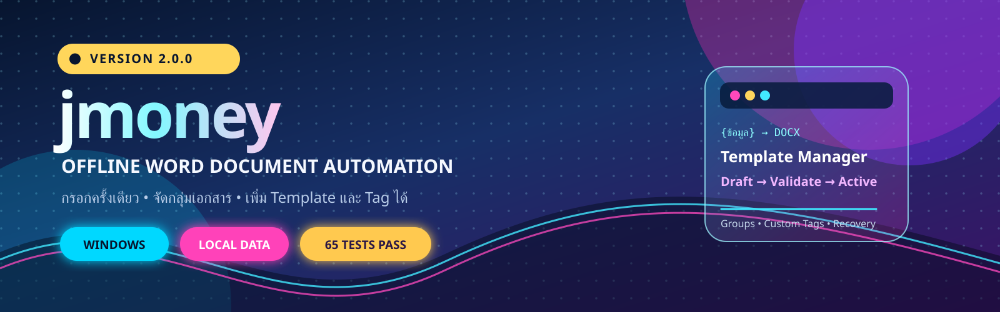
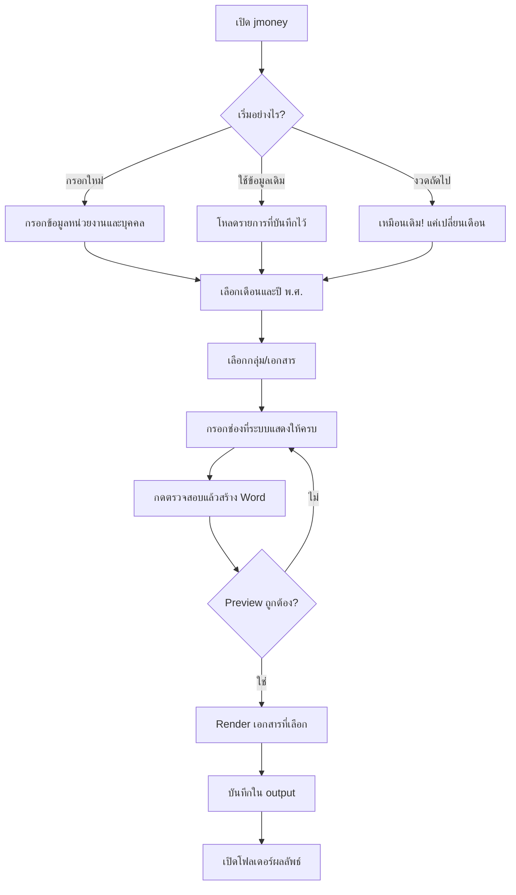
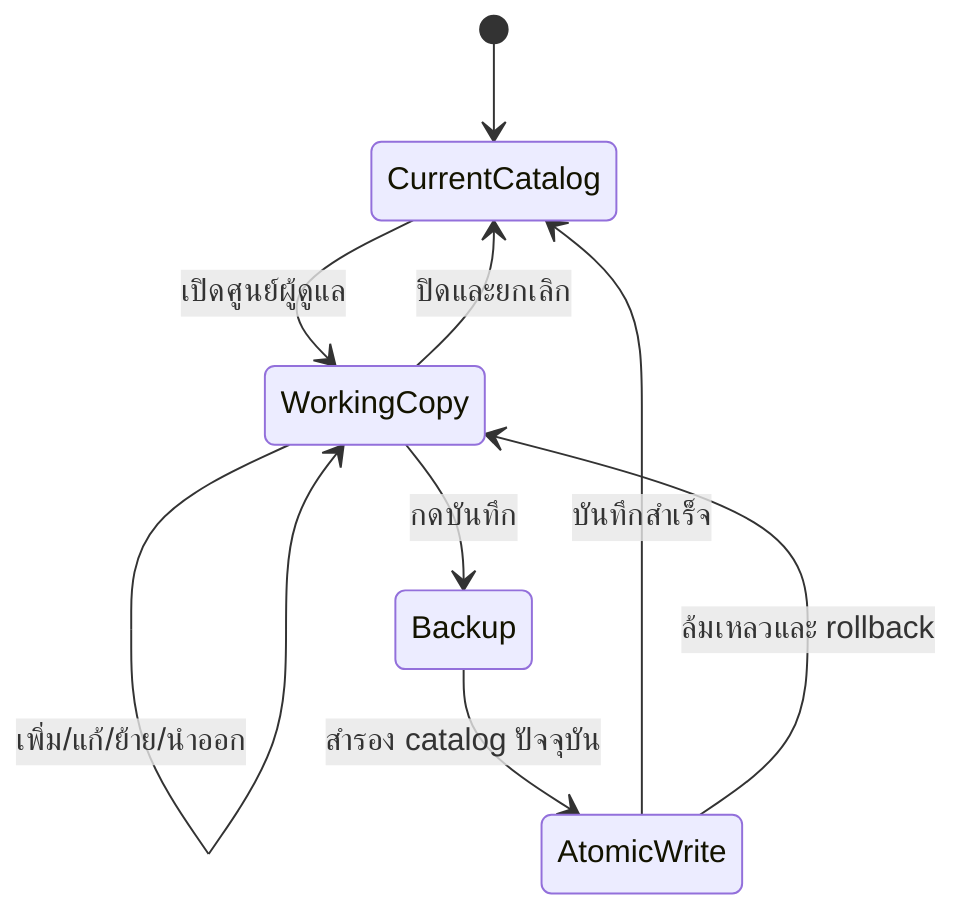
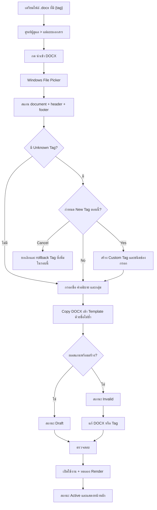
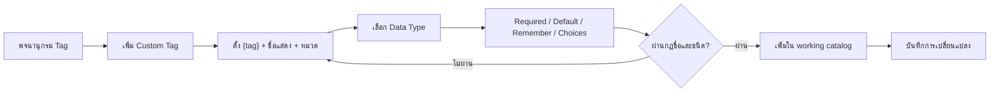
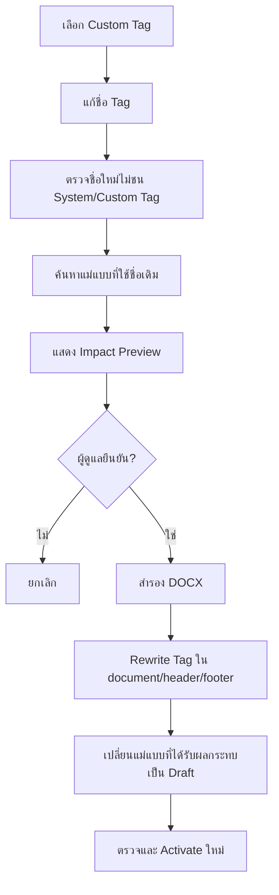
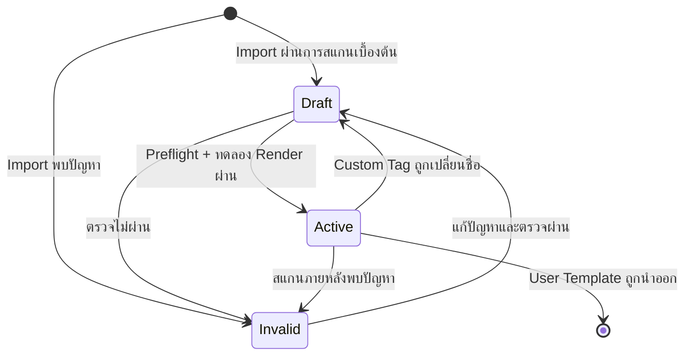
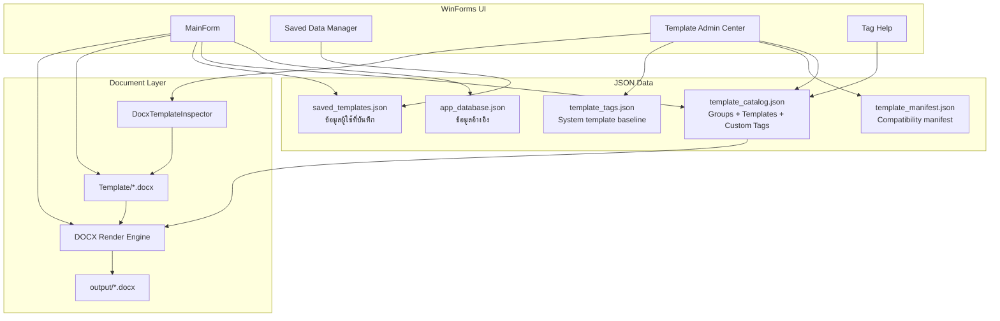
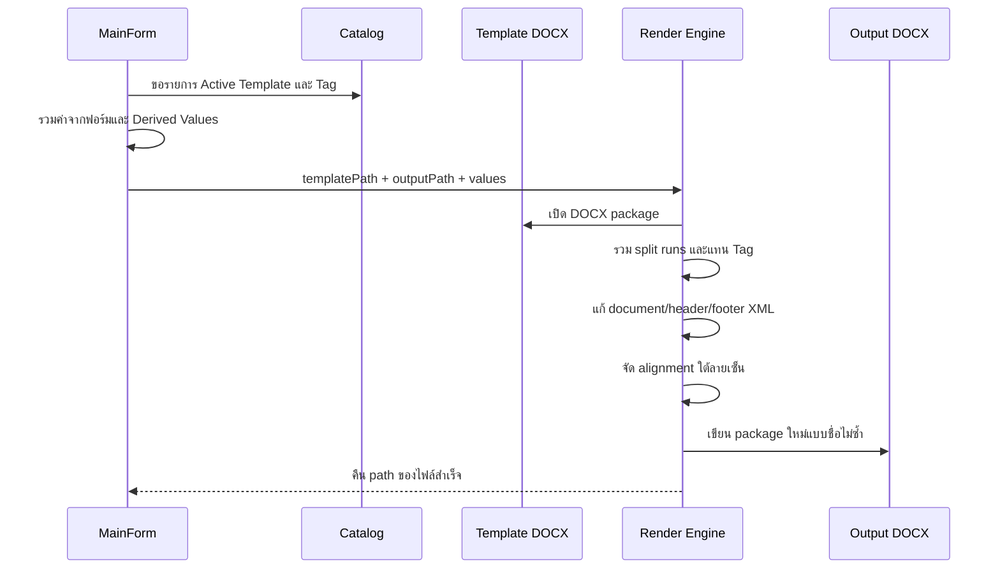

<div align="center">



<p>
  
  
  
  
</p>

### โปรแกรมสร้างและบริหารชุดเอกสาร Word แบบออฟไลน์สำหรับ Windows

กรอกข้อมูลครั้งเดียว → เลือกเอกสารเป็นกลุ่ม → สร้าง Word หลายฉบับ<br>
<strong>เพิ่ม Template และ Custom Tag ได้โดยไม่แก้โค้ด</strong>

<p>
  <a href="./assets/downloads/ReimbursementDocApp-Installer.zip"></a>
  <a href="#ติดตั้งด่วน--เลือกวิธีที่ถนัด"></a>
  <a href="https://robbygrean.github.io/jmoney/guide.html"></a>
  <a href="./assets/downloads/ReimbursementDocApp-Source.zip"></a>
  <a href="https://github.com/RobbyGrean/jmoney/tree/main/Handof6steps"></a>
</p>

<p>
  <a href="https://robbygrean.github.io/jmoney/#download"><kbd>🌐 เยี่ยมชมหน้าดาวน์โหลด</kbd></a>
  &nbsp;
  <a href="https://robbygrean.github.io/jmoney/guide.html"><kbd>📖 เยี่ยมชมหน้าไกด์คู่มือ</kbd></a>
</p>

</div>

<p align="center">🟦 🟪 🟨 🩷 🟦 🟪 🟨 🩷 🟦 🟪 🟨 🩷 🟦 🟪 🟨 🩷 🟦</p>

## ติดตั้งด่วน — เลือกวิธีที่ถนัด

### วิธี A — ดาวน์โหลดแล้วเปิด Setup

เหมาะกับผู้ใช้ทั่วไปและไม่ต้องติดตั้ง Node.js:

1. ดาวน์โหลด [ReimbursementDocApp-Installer.zip](./assets/downloads/ReimbursementDocApp-Installer.zip)
2. คลิกขวาไฟล์ ZIP แล้วเลือก **Extract All / แยกไฟล์ทั้งหมด**
3. เปิดโฟลเดอร์ที่แตกแล้ว จากนั้นเปิด `ReimbursementDocApp-Setup.exe`
4. ทำตามหน้าต่าง Setup จนเสร็จ โปรแกรมจะเปิดให้อัตโนมัติ
5. ครั้งถัดไปเปิดได้จาก Desktop หรือ Start Menu

> [!IMPORTANT]
> ต้องแตก ZIP ก่อนเปิด Setup และควรปิด jmoney กับเอกสาร Word ที่เกี่ยวข้องก่อนติดตั้งทับเพื่ออัปเดต

### วิธี B — สั่งผ่าน PowerShell ด้วย `npx.cmd`

เหมาะกับผู้ที่ต้องการคำสั่งติดตั้ง อัปเดต หรือตรวจสอบรุ่นจาก shell โดยเครื่องต้องเป็น Windows และมี **Node.js 18 ขึ้นไป** พร้อม `npm`/`npx`

1. เปิด Start Menu พิมพ์ `PowerShell` แล้วเปิด **Windows PowerShell**
2. ตรวจว่า Node.js และ npx พร้อมใช้งาน:

   ```powershell
   node --version
   npx --version
   ```

3. ติดตั้ง jmoney รุ่นล่าสุด:

   ```powershell
   npx.cmd --yes @robbygrean/jmoney-installer@latest install
   ```

4. รอให้คำสั่งดาวน์โหลดและตรวจ SHA-256 จากนั้นหน้าต่าง Setup จะเปิดขึ้น
5. ทำตามหน้าต่าง Setup ให้เสร็จเหมือนการติดตั้งแบบ Manual

คำสั่งที่ใช้ภายหลัง:

| งานที่ต้องการ | คำสั่ง PowerShell |
|---|---|
| ติดตั้งรุ่นล่าสุด | `npx.cmd --yes @robbygrean/jmoney-installer@latest install` |
| อัปเดตโปรแกรมที่ติดตั้งอยู่ | `npx.cmd --yes @robbygrean/jmoney-installer@latest update` |
| อัปเดตด้วยชื่อคำสั่งแบบ patch | `npx.cmd --yes @robbygrean/jmoney-installer@latest patch` |
| ดูรุ่นที่ติดตั้งและรุ่นล่าสุด | `npx.cmd --yes @robbygrean/jmoney-installer@latest status` |
| ดูรุ่นที่ package รองรับ | `npx.cmd --yes @robbygrean/jmoney-installer@latest versions` |
| ทดลองดูว่าจะทำอะไรโดยยังไม่ติดตั้ง | เติม `--dry-run` หลังคำสั่ง `install`, `update` หรือ `patch` |

ตัวอย่างตรวจสอบก่อนติดตั้งจริง:

```powershell
npx.cmd --yes @robbygrean/jmoney-installer@latest install --dry-run
```

ตัวอย่างเลือกรุ่นที่ระบุ:

```powershell
npx.cmd --yes @robbygrean/jmoney-installer@latest install 2.0.0
```

> [!NOTE]
> `update` และ `patch` เป็นคำสั่งเดียวกันในรุ่นปัจจุบัน โดยดาวน์โหลด Installer ZIP เต็มชุดที่ตรวจ checksum แล้วเปิด Setup ในโหมดอัปเกรด ระบบจะรักษาข้อมูลเดิมและสร้าง backup ตามกลไกของ installer ไม่ใช่ binary delta patch

> [!CAUTION]
> คำสั่ง npx ไม่ปิดหรือข้าม Windows SmartScreen/Defender และ Setup รุ่นปัจจุบันยังมีหน้าต่างให้ผู้ใช้กดยืนยัน ไม่ใช่ silent install หลังติดตั้งแล้วตัวโปรแกรม jmoney ยังทำงานแบบ offline/local-first ตามเดิม

> [!TIP]
> บน Windows PowerShell ให้ใช้ `npx.cmd` ตามตัวอย่างด้านบน เพื่อหลีกเลี่ยงกรณีที่นโยบาย PowerShell บล็อกไฟล์ `npx.ps1` ส่วน Command Prompt ใช้ `npx` หรือ `npx.cmd` ได้ทั้งคู่

ถ้าคำสั่ง `node` หรือ `npx` ไม่พบ และไม่ต้องการติดตั้ง Node.js ให้ใช้ **วิธี A** ได้ทันที ส่วนรายละเอียดการติดตั้ง การอัปเกรด และ checksum อยู่ในหัวข้อ [ดาวน์โหลด ติดตั้ง และอัปเกรด](#ดาวน์โหลด-ติดตั้ง-และอัปเกรด)

> [!TIP]
> **jmoney 2.0 มีสองเส้นทางชัดเจน:** ผู้ใช้ทั่วไปสร้างเอกสารจากหน้าหลัก ส่วนผู้ดูแลใช้ศูนย์จัดการกลุ่ม แม่แบบ และ Tag โดยมี Draft → Validate → Trial Render → Active คอยกันเอกสารที่ยังไม่พร้อม

<table>
  <tr>
    <td align="center" width="33%"><b>⚡ 1 ครั้ง</b><br>กรอกข้อมูลชุดเดียว</td>
    <td align="center" width="33%"><b>🗂️ หลายกลุ่ม</b><br>เลือกเอกสารตามกระบวนการ</td>
    <td align="center" width="33%"><b>🛡️ 65 Tests</b><br>ตรวจ document และ upgrade</td>
  </tr>
</table>

---

## สารบัญ

1. [jmoney คืออะไร](#jmoney-คืออะไร)
2. [ภาพรวม Workflow ทั้งระบบ](#ภาพรวม-workflow-ทั้งระบบ)
3. [ดาวน์โหลด ติดตั้ง และอัปเกรด](#ดาวน์โหลด-ติดตั้ง-และอัปเกรด)
4. [ความสามารถทั้งหมด](#ความสามารถทั้งหมด)
5. [เอกสารมาตรฐานที่สร้างได้](#เอกสารมาตรฐานที่สร้างได้)
6. [วิธีใช้งานสำหรับผู้ใช้ทั่วไป](#วิธีใช้งานสำหรับผู้ใช้ทั่วไป)
7. [ระบบข้อมูลเดิมสำหรับใช้งานครั้งถัดไป](#ระบบข้อมูลเดิมสำหรับใช้งานครั้งถัดไป)
8. [ศูนย์ผู้ดูแลแม่แบบ](#ศูนย์ผู้ดูแลแม่แบบ)
9. [Workflow เพิ่มและลด Template](#workflow-เพิ่มและลด-template)
10. [ระบบ Tag และ Custom Tag](#ระบบ-tag-และ-custom-tag)
11. [Workflow เพิ่ม แก้ชื่อ และลบ Custom Tag](#workflow-เพิ่ม-แก้ชื่อ-และลบ-custom-tag)
12. [การตรวจสอบแม่แบบและวงจรสถานะ](#การตรวจสอบแม่แบบและวงจรสถานะ)
13. [สถาปัตยกรรมและ Data Flow](#สถาปัตยกรรมและ-data-flow)
14. [กฎทางธุรกิจ](#กฎทางธุรกิจ)
15. [โครงสร้างข้อมูลและไฟล์](#โครงสร้างข้อมูลและไฟล์)
16. [การสำรองและกู้คืน](#การสำรองและกู้คืน)
17. [สำหรับนักพัฒนา](#สำหรับนักพัฒนา)
18. [การทดสอบและ Release Checklist](#การทดสอบและ-release-checklist)
19. [ความปลอดภัย ความเป็นส่วนตัว และข้อจำกัด](#ความปลอดภัย-ความเป็นส่วนตัว-และข้อจำกัด)
20. [Roadmap และ Handoff สำหรับพัฒนาต่อ](#roadmap-และ-handoff-สำหรับพัฒนาต่อ)
21. [รุ่นเก่าและประวัติการเปลี่ยนแปลง](#รุ่นเก่าและประวัติการเปลี่ยนแปลง)

---

## jmoney คืออะไร

jmoney หรือ `ReimbursementDocApp` เป็น WinForms desktop application สำหรับสร้างเอกสารสำนักงานจาก Word template โดยเน้นงานเบิกจ่ายรายเดือนของหน่วยงานหรือโรงเรียน

ผู้ใช้กรอกข้อมูลบุคคล หน่วยงาน งวด และข้อมูลการเงินเพียงครั้งเดียว จากนั้นเลือกเอกสารที่ต้องการ ระบบจะนำข้อมูลชุดเดียวกันไปแทน `{tag}` ในแม่แบบ `.docx` หลายไฟล์

โปรแกรมทำงานแบบ **offline และ local-first**:

- ไม่ใช่เว็บแอป
- ไม่ส่งข้อมูลเอกสารไปยัง cloud
- ไม่ต้องใช้ Google Drive, Google Sheet หรือบัญชี Google
- ไม่ต้องมี Microsoft 365 license เพื่อให้ระบบแทนค่าใน `.docx`
- ไม่ต้องเปิด Excel ระหว่างใช้งาน
- Word template ยังคงเป็นต้นฉบับด้านหน้าตาเอกสาร
- JSON เป็นข้อมูลหลักด้านรายการเอกสาร Tag และข้อมูลสำหรับใช้ซ้ำ

### ภาพรวมใน 30 วินาที

| ผู้ใช้ | สิ่งที่ทำ | ผลลัพธ์ |
|---|---|---|
| ผู้ใช้ทั่วไป | เลือกงวด เลือกเอกสาร กรอกข้อมูล ตรวจสอบ แล้วสร้าง | Word หลายฉบับใน `output` |
| ผู้ใช้ที่ทำงานซ้ำ | โหลดชุดข้อมูลเดิมและเลื่อนไปงวดถัดไป | ลดการกรอกข้อมูลซ้ำ |
| ผู้ดูแล | จัดกลุ่ม นำเข้า DOCX กำหนด Tag ตรวจสอบ และเปิดใช้งาน | เพิ่มกระบวนการเอกสารใหม่โดยไม่แก้โค้ด |
| นักพัฒนา | ตรวจ source, build scripts, catalog และ tests | ตรวจสอบหรือต่อยอดระบบได้ |

---

## ภาพรวม Workflow ทั้งระบบ

ภาพนี้แสดงความสัมพันธ์ระหว่างงานประจำของผู้ใช้กับเครื่องมือผู้ดูแล โดยทั้งสองเส้นทางมาพบกันที่รายการแม่แบบสถานะ `Active`


```mermaid
flowchart LR
    subgraph ADMIN["ศูนย์ผู้ดูแล — ใช้เมื่อเปลี่ยนโครงสร้างระบบ"]
        A1["สร้าง/ตั้งชื่อกลุ่มเอกสาร"]
        A2["เลือกไฟล์ DOCX จากเครื่อง"]
        A3["Copy เข้าโฟลเดอร์ Template"]
        A4{"พบ Tag ใหม่?"}
        A5["กำหนด Custom Tag"]
        A6["บันทึกเป็น Draft"]
        A7["ตรวจ Tag และโครงสร้าง DOCX"]
        A8{"Preflight ผ่าน?"}
        A9["ทดลอง Render"]
        A10{"ทดลองผ่าน?"}
        A11["เปลี่ยนเป็น Active"]
        AX["Invalid / แก้ DOCX หรือ Tag"]

        A1 --> A2 --> A3 --> A4
        A4 -- "พบ" --> A5 --> A6
        A4 -- "ไม่พบ" --> A6
        A6 --> A7 --> A8
        A8 -- "ไม่ผ่าน" --> AX --> A7
        A8 -- "ผ่าน" --> A9 --> A10
        A10 -- "ไม่ผ่าน" --> AX
        A10 -- "ผ่าน" --> A11
    end

    subgraph USER["หน้าหลัก — งานประจำของผู้ใช้ทั่วไป"]
        U1["โหลดข้อมูลเดิมหรือเริ่มกรอกใหม่"]
        U2["เลือกเดือนและปี พ.ศ."]
        U3["เลือกกลุ่ม/เอกสาร Active"]
        U4["ฟอร์มแสดงช่องที่จำเป็น"]
        U5["ตรวจ Required Fields"]
        U6["Preview และยืนยัน"]
        U7["แทนค่า Tag ใน DOCX"]
        U8["สร้างไฟล์ใน output"]
        U9["บันทึกงวดล่าสุดเมื่อสำเร็จ"]

        U1 --> U2 --> U3 --> U4 --> U5 --> U6 --> U7 --> U8 --> U9
    end

    A11 -->|"ปรากฏในรายการเอกสาร"| U3
```

### หลักการแบ่งหน้าที่

- หน้าหลักมีเฉพาะสิ่งที่ต้องใช้สร้างเอกสารประจำวัน
- ปุ่ม `ตั้งค่า` เป็นทางเข้าสู่ศูนย์ผู้ดูแลและแสดงคำเตือนก่อนเปิด
- `Draft` และ `Invalid` ไม่ปรากฏให้ผู้ใช้เลือกสร้าง
- มีเฉพาะแม่แบบ `Active` เท่านั้นที่เข้าสู่ Workflow การสร้างเอกสารจริง
- System Template และ System Tag ถูกล็อกเพื่อลดความเสียหายจากการแก้โดยไม่ตั้งใจ

---

## ดาวน์โหลด ติดตั้ง และอัปเกรด

### ไฟล์เผยแพร่ปัจจุบัน

| รายการ | เหมาะสำหรับ | ดาวน์โหลด |
|---|---|---|
| Installer ZIP | ผู้ใช้ทั่วไป | [ReimbursementDocApp-Installer.zip](./assets/downloads/ReimbursementDocApp-Installer.zip) |
| Source ZIP | นักพัฒนาและผู้ตรวจสอบ | [ReimbursementDocApp-Source.zip](./assets/downloads/ReimbursementDocApp-Source.zip) |
| คู่มือหน้าเว็บ | อ่านวิธีใช้งานแบบเป็นขั้นตอน | [guide.html](./guide.html) |
| คู่มือข้อความ | เก็บ offline หรือส่งต่อ | [README-การลงโปรแกรมและการใช้งาน.txt](./assets/downloads/README-การลงโปรแกรมและการใช้งาน.txt) |

### ตรวจสอบไฟล์รุ่น 2.0.0

| ไฟล์ | ขนาด | SHA-256 |
|---|---:|---|
| `ReimbursementDocApp-Installer.zip` | 563,638 bytes | `457D9AEBEDCD86323D6CB2B345851A3548420E0E890B20DF7D0E5FB544593D09` |
| `ReimbursementDocApp-Source.zip` | 1,794,817 bytes | `0F0E769BCFFDAB742B3CF0AF86CC41F3F2D788930393045CB6B3C13F2CF85CC5` |

ตรวจด้วย PowerShell:

```powershell
Get-FileHash .\ReimbursementDocApp-Installer.zip -Algorithm SHA256
Get-FileHash .\ReimbursementDocApp-Source.zip -Algorithm SHA256
```

### วิธีติดตั้งใหม่

1. ดาวน์โหลด Installer ZIP
2. แตกไฟล์ ZIP ก่อน
3. เปิด `ReimbursementDocApp-Setup.exe`
4. รอให้ตัวติดตั้งคัดลอกโปรแกรมและแม่แบบ
5. เปิด `ReimbursementDocApp` จาก Desktop หรือ Start Menu

โปรแกรมติดตั้งที่:

```text
%LOCALAPPDATA%\ReimbursementDocApp
```

### วิธีอัปเกรดจากรุ่นเดิม

1. ปิด jmoney
2. ปิดเอกสาร Word ที่เปิดจากโฟลเดอร์ของโปรแกรม
3. ดาวน์โหลดและแตก Installer รุ่นใหม่
4. เปิด Setup เพื่อติดตั้งทับ
5. เปิดโปรแกรมและตรวจกลุ่ม แม่แบบ และข้อมูลเดิม

ตัวติดตั้งแบบ upgrade-safe จะ:

- รักษา `saved_templates.json`
- รักษาเอกสารทั้งหมดใน `output`
- รักษาแม่แบบที่ผู้ใช้เพิ่มเอง
- รักษากลุ่ม, Custom Tag, catalog และ manifest ของระบบรุ่นใหม่
- อัปเดต executable, database และแม่แบบมาตรฐานที่มากับ release
- สำรองไฟล์ระบบเดิมที่จะถูกแทนที่ไว้ใน `admin-backups/installer-upgrade-*`
- ใช้ temporary file และ atomic replace เพื่อลดความเสี่ยงจากการเขียนไฟล์ไม่สมบูรณ์

### คำเตือนจาก Chrome และ Windows

Chrome หรือ Windows SmartScreen อาจเตือนเพราะโปรแกรมยังไม่มี code-signing certificate และยังไม่เป็นที่รู้จักในวงกว้าง

- ตรวจว่าดาวน์โหลดจาก repository นี้
- ตรวจชื่อไฟล์ให้ตรงกับตาราง
- หาก Windows แสดง `Windows protected your PC` ให้กด `More info`
- กด `Run anyway` เฉพาะเมื่อแหล่งดาวน์โหลดและชื่อไฟล์ถูกต้อง

---

## ความสามารถทั้งหมด

### การกรอกและจัดการข้อมูล

- กรอกข้อมูลชุดเดียวแล้วใช้กับเอกสารหลายฉบับ
- แยกข้อมูลหน่วยงาน ผู้รับจ้าง ที่อยู่ ผู้ลงนาม การเงิน พัสดุ และคณะกรรมการ
- เติมเงินเดือนและคำอ่านเงินเดือนจากตำแหน่งที่เลือก
- รองรับข้อมูลหัวหน้าการเงินแบบ optional
- แสดง Error Provider ที่ช่องข้อมูลซึ่งจำเป็นแต่ยังว่าง
- สร้างช่องกรอก Custom Tag ตามเอกสารที่เลือกจริง
- Custom Tag ตั้งค่า required, default value และ remember last value ได้

### เดือน วันที่ และปีงบประมาณ

- เลือกเดือนส่งมอบและปี พ.ศ.
- คำนวณงวด 1–12 ตามปีงบประมาณ
- คำนวณปีงบประมาณจากเดือนส่งมอบ
- ดึงวันที่ส่งเบิกจากฐานข้อมูลเดือน/ปีงบประมาณเมื่อมีข้อมูล
- แปลงวันที่สั่งจ้างเป็นรูปแบบวันที่ไทย
- แยกค่าที่ผู้ใช้กรอกจากค่าที่ระบบคำนวณ

### การเลือกเอกสาร

- แสดงเอกสารเป็น tree แบ่งตามกลุ่ม
- ขยายและยุบกลุ่มได้
- เลือกทั้งกลุ่มหรือเลือกเอกสารรายฉบับได้
- แสดงเฉพาะแม่แบบ `Active`
- ชื่อกลุ่มและชื่อเอกสารถูกจัดความสูงบรรทัดให้ไม่ถูกตัด
- ฟอร์มปรับช่องข้อมูลตาม Tag union ของเอกสารที่เลือก

### การตรวจสอบก่อนสร้าง

- ต้องเลือกเอกสารอย่างน้อยหนึ่งฉบับ
- ตรวจ Required Field ของ System Tag และ Custom Tag
- ตรวจ path ของ Template และ Output
- แสดง Preview เดือน งวด ปีงบประมาณ จำนวนเอกสาร และ output path
- เตือนให้ปิด Word ก่อนสร้างเมื่อมีความเสี่ยงเรื่องไฟล์ถูกล็อก

### การสร้าง Word

- ใช้ `.docx` เดิมเป็น source of truth ด้าน layout
- แทน Tag ใน `word/document.xml`
- แทน Tag ใน Header และ Footer
- รองรับ Tag ที่ Word แบ่งออกเป็นหลาย run
- รักษาตาราง ฟอนต์ ระยะ และองค์ประกอบของต้นฉบับ
- จัดบรรทัดชื่อและตำแหน่งใต้ลายเซ็นที่กำหนดให้กึ่งกลาง
- ป้องกันชื่อ output ซ้ำด้วย unique suffix
- เปิดโฟลเดอร์ output หลังสร้างเสร็จได้

### การบริหารระบบ

- เพิ่ม แก้ชื่อ เรียงลำดับ และลบกลุ่มว่าง
- นำเข้า DOCX จากตำแหน่งใดก็ได้ผ่าน Windows File Picker
- กำหนดชื่อแสดง คำอธิบาย และกลุ่มของแม่แบบ
- ย้ายแม่แบบระหว่างกลุ่ม
- ตรวจสอบและเปิดใช้งานแม่แบบแบบมี lifecycle
- เพิ่ม แก้ชื่อ และลบ Custom Tag อย่างมีการตรวจผลกระทบ
- สแกนแม่แบบทั้งหมด
- สำรองและคืนค่า catalog
- นำแม่แบบออกโดยเก็บไฟล์ไว้หรือย้ายไปพื้นที่กู้คืน

---

## เอกสารมาตรฐานที่สร้างได้

รุ่น 2.0.0 มี System Template เริ่มต้น 5 ฉบับในกลุ่ม `ชุดส่งเบิกเงินเดือน`

| ลำดับ | เอกสาร | หน้าที่ |
|---:|---|---|
| 1 | หนังสือส่งเบิกจ้างเหมา | หนังสือนำส่งเอกสารเบิกจ่าย |
| 2 | ใบส่งมอบงาน | รายละเอียดการส่งมอบ เงินเดือน และใบสั่งจ้าง |
| 3 | ใบตรวจรับ | เอกสารตรวจรับและรายชื่อคณะกรรมการ |
| 4 | บันทึกอนุมัติเบิกจ่าย | เอกสารเสนออนุมัติและผู้เกี่ยวข้อง |
| 5 | ใบสำคัญรับเงิน | หลักฐานรับเงินและที่อยู่ผู้รับจ้าง |

เอกสารทั้งห้าฉบับ:

- อยู่ในสถานะ `Active`
- มี source เป็น `built-in`
- ถูกล็อกไม่ให้ผู้ดูแลนำออกจาก catalog
- สามารถอัปเดตผ่าน release รุ่นใหม่
- ผ่าน preflight, catalog-to-DOCX tag matching และ render test

ระบบไม่ได้จำกัดไว้ที่ 5 ฉบับ ผู้ดูแลสามารถสร้างกลุ่มใหม่ เช่น `กระบวนการทำสัญญา` แล้วเพิ่มเอกสารอีก 11 แบบหรือมากกว่านั้นได้

---

## วิธีใช้งานสำหรับผู้ใช้ทั่วไป


```mermaid
flowchart TD
    S["เปิด jmoney"] --> P{"เริ่มอย่างไร?"}
    P -- "กรอกใหม่" --> F["กรอกข้อมูลหน่วยงานและบุคคล"]
    P -- "ใช้ข้อมูลเดิม" --> L["โหลดรายการที่บันทึกไว้"]
    P -- "งวดถัดไป" --> N["เหมือนเดิม! แค่เปลี่ยนเดือน"]
    F --> M["เลือกเดือนและปี พ.ศ."]
    L --> M
    N --> M
    M --> D["เลือกกลุ่ม/เอกสาร"]
    D --> C["กรอกช่องที่ระบบแสดงให้ครบ"]
    C --> V["กดตรวจสอบแล้วสร้าง Word"]
    V --> Q{"Preview ถูกต้อง?"}
    Q -- "ไม่" --> C
    Q -- "ใช่" --> G["Render เอกสารที่เลือก"]
    G --> O["บันทึกใน output"]
    O --> R["เปิดโฟลเดอร์ผลลัพธ์"]
```

### ขั้นตอนใช้งาน

1. เปิดโปรแกรมจาก Desktop หรือ Start Menu
2. ตรวจ Template path และ Output path
3. เลือกเดือนส่งมอบและปี พ.ศ.
4. ตรวจงวดและปีงบประมาณที่ระบบคำนวณ
5. เลือกกลุ่มหรือเอกสารที่ต้องการสร้าง
6. กรอกข้อมูลในแต่ละหมวด
7. ตรวจช่อง Custom Tag ที่อาจปรากฏตามเอกสารที่เลือก
8. กด `ตรวจสอบแล้วสร้าง Word`
9. อ่าน Preview และยืนยันเมื่อข้อมูลถูกต้อง
10. เปิด output เพื่อตรวจเอกสารที่สร้าง

### ตำแหน่ง Output เริ่มต้น

```text
%LOCALAPPDATA%\ReimbursementDocApp\output
```

ชื่อไฟล์ใช้รูปแบบ:

```text
ชื่อเอกสาร_ชื่อลูกจ้าง_ชื่อโรงเรียน.docx
```

หากชื่อซ้ำ ระบบเพิ่ม suffix เพื่อไม่เขียนทับไฟล์เดิมโดยไม่ตั้งใจ

---

## ระบบข้อมูลเดิมสำหรับใช้งานครั้งถัดไป

คำว่า “Template” ในส่วนนี้หมายถึง **ชุดข้อมูลที่บันทึกไว้** ไม่ใช่ Word template

### บันทึกเป็นรายการใหม่

1. กรอกข้อมูลประจำให้ครบ
2. กด `บันทึกเป็น Template`
3. เลือกบันทึกเป็นรายการใหม่
4. ตั้งชื่อและหมายเหตุที่ค้นหาได้ง่าย

### บันทึกทับรายการเดิม

ใช้เมื่อต้องการแก้ข้อมูลประจำ เช่น ที่อยู่ ตำแหน่ง หรือผู้ลงนาม:

1. กด `บันทึกเป็น Template`
2. เลือกบันทึกทับ
3. เลือกรายการให้ถูกต้อง
4. ยืนยันก่อนแทนข้อมูลเดิม

### จัดการรายการ

หน้า `จัดการ Template` รองรับ:

- โหลดข้อมูลกลับเข้าฟอร์มโดยไม่เลื่อนเดือน
- แก้ชื่อและหมายเหตุ
- ลบรายการที่ไม่ใช้แล้ว
- ดูข้อมูลประกอบก่อนตัดสินใจโหลด

### เหมือนเดิม! แค่เปลี่ยนเดือน

ระบบใช้ `LastGeneratedFiscalMonth` และ `LastGeneratedFiscalYear` ของรายการนั้นเป็นฐาน แล้วเสนอเดือนถัดไป

- ติดตามงวดหลังจากสร้างเอกสารสำเร็จเท่านั้น
- ถ้าสร้างเอกสารย้อนหลัง ระบบไม่ถอยงวดล่าสุดกลับ
- รายการจากรุ่นเก่าที่ยังไม่มี metadata ใช้เดือน/ปีที่บันทึกไว้เป็น fallback
- ผู้ใช้ต้องตรวจเดือนและปีงบประมาณก่อนสร้างทุกครั้ง

ข้อมูลส่วนนี้อยู่ใน:

```text
saved_templates.json
```

---

## ศูนย์ผู้ดูแลแม่แบบ

ศูนย์ผู้ดูแลเป็นพื้นที่สำหรับเปลี่ยน “โครงสร้างระบบเอกสาร” จึงถูกแยกออกจากหน้าผู้ใช้ทั่วไป

### วิธีเข้า

1. กด `ตั้งค่า` ใต้รายการเอกสาร
2. อ่านคำเตือน
3. ยืนยันเพื่อเข้าสู่ศูนย์ผู้ดูแล

### หน้าภายในศูนย์ผู้ดูแล

| หน้า | ใช้ทำอะไร |
|---|---|
| ภาพรวม | ดูจำนวนกลุ่ม แม่แบบพร้อมใช้ ฉบับร่าง แม่แบบมีปัญหา และ Custom Tag |
| กลุ่มเอกสาร | เพิ่ม แก้ชื่อ ใส่คำอธิบาย เรียง และลบกลุ่มว่าง |
| แม่แบบเอกสาร | นำเข้า แก้คุณสมบัติ ย้ายกลุ่ม ตรวจ เปิดใช้งาน หรือนำออก |
| พจนานุกรม Tag | ค้นหา System/Custom Tag ดูชนิดข้อมูลและเอกสารที่ใช้ |
| ตรวจสอบและกู้คืน | สแกนทั้งหมด สำรอง คืนค่า และเปิดพื้นที่กู้คืน |

### Transaction ของศูนย์ผู้ดูแล

การเปลี่ยนแปลงเกิดกับ working copy ก่อน ผู้ใช้ต้องกด `บันทึกการเปลี่ยนแปลง` จึงเขียนลงระบบจริง


```mermaid
stateDiagram-v2
    [*] --> CurrentCatalog
    CurrentCatalog --> WorkingCopy: เปิดศูนย์ผู้ดูแล
    WorkingCopy --> WorkingCopy: เพิ่ม/แก้/ย้าย/นำออก
    WorkingCopy --> CurrentCatalog: ปิดและยกเลิก
    WorkingCopy --> Backup: กดบันทึก
    Backup --> AtomicWrite: สำรอง catalog ปัจจุบัน
    AtomicWrite --> CurrentCatalog: บันทึกสำเร็จ
    AtomicWrite --> WorkingCopy: ล้มเหลวและ rollback
```

ถ้าปิดหน้าต่างโดยไม่บันทึก:

- ไฟล์ที่เพิ่ง import จะถูกลบออก
- การเปลี่ยนชื่อ Tag ใน DOCX จะย้อนจากสำเนา
- catalog ตัวจริงไม่เปลี่ยน

---

## Workflow เพิ่มและลด Template

### เพิ่ม Template ใหม่


```mermaid
flowchart TD
    T0["เตรียมไฟล์ .docx ที่มี {tag}"] --> T1["ศูนย์ผู้ดูแล > แม่แบบเอกสาร"]
    T1 --> T2["กด นำเข้า DOCX"]
    T2 --> T3["Windows File Picker"]
    T3 --> T4["สแกน document + header + footer"]
    T4 --> T5{"มี Unknown Tag?"}
    T5 -- "ไม่มี" --> T8["กรอกชื่อ คำอธิบาย และกลุ่ม"]
    T5 -- "มี" --> T6{"กำหนด New Tag ตอนนี้?"}
    T6 -- "Cancel" --> TC["ยกเลิกและ rollback Tag ที่เพิ่มในรอบนี้"]
    T6 -- "No" --> T8
    T6 -- "Yes" --> T7["สร้าง Custom Tag และชนิดช่องกรอก"]
    T7 --> T8
    T8 --> T9["Copy DOCX เข้า Template ด้วยชื่อไม่ซ้ำ"]
    T9 --> T10{"ผลสแกนพร้อมสร้าง?"}
    T10 -- "ใช่" --> TD["สถานะ Draft"]
    T10 -- "ไม่" --> TI["สถานะ Invalid"]
    TD --> TV["ตรวจสอบ"]
    TI --> FIX["แก้ DOCX หรือ Tag"] --> TV
    TV --> TA["เปิดใช้งาน + ทดลอง Render"]
    TA --> ACTIVE["สถานะ Active และแสดงหน้าหลัก"]
```

รายละเอียดสำคัญ:

- File Picker รับเฉพาะ `.docx`
- ต้นฉบับจากตำแหน่งที่เลือกไม่ถูกแก้ไข
- ระบบ copy ต้นฉบับเข้า `%LOCALAPPDATA%\ReimbursementDocApp\Template`
- หากชื่อไฟล์ซ้ำ ระบบสร้างชื่อใหม่ที่ไม่ชนกัน
- เอกสารใหม่ไม่เข้าสู่หน้าหลักทันที
- Unknown Tag สามารถนิยามเป็น Custom Tag ระหว่าง import
- ถ้ายกเลิก import ระบบย้อน Custom Tag ที่เพิ่งสร้างในรอบนั้น

### แก้ชื่อ คำอธิบาย หรือย้ายกลุ่ม

1. เลือกแม่แบบ
2. กด `แก้ไข / ย้ายกลุ่ม`
3. แก้ชื่อที่แสดงหรือคำอธิบาย
4. เลือกกลุ่มปลายทาง
5. บันทึกการเปลี่ยนแปลง

การย้ายกลุ่มเปลี่ยนเฉพาะ `GroupId` ใน catalog ไม่ย้ายหรือแก้ binary ของ DOCX

### นำ Template ออกจากระบบ

System Template นำออกไม่ได้ ส่วน User Template มีสามทางเลือก:

| คำตอบ | ผลต่อ catalog | ผลต่อ DOCX |
|---|---|---|
| Yes | นำรายการออก | ย้าย DOCX ไป `admin-backups/removed-*` |
| No | นำรายการออก | เก็บ DOCX ไว้ใน `Template` |
| Cancel | ไม่เปลี่ยน | ไม่เปลี่ยน |

การย้ายไฟล์ไปพื้นที่กู้คืนเกิดตอนกดบันทึก หากบันทึกล้มเหลว ระบบย้ายไฟล์กลับ

### ลดหรือลบกลุ่มเอกสาร

- ระบบต้องเหลืออย่างน้อยหนึ่งกลุ่ม
- ลบได้เฉพาะกลุ่มที่ไม่มีเอกสาร
- ถ้ายังมีเอกสาร ต้องย้ายหรือนำเอกสารออกก่อน
- หลังลบ ระบบจัด `SortOrder` ใหม่

---

## ระบบ Tag และ Custom Tag

Tag คือ placeholder ใน Word ที่อยู่ในรูป:

```text
{ชื่อแท็ก}
```

### System Tag กับ Custom Tag

| ประเภท | แหล่งที่มา | ผู้ดูแลแก้ชื่อ/ลบได้หรือไม่ | หน้าที่ |
|---|---|---|---|
| System Tag | โปรแกรม | ไม่ได้ | ข้อมูลและ business rule มาตรฐาน |
| Custom Tag | ผู้ดูแลสร้าง | ได้เมื่อผ่านกฎผลกระทบ | ขยายช่องข้อมูลสำหรับเอกสารใหม่ |

### กลุ่ม System Tag สำคัญ

#### งวดและวันที่

- `{เดือนที่ส่งมอบ}`
- `{ย่อเดือนที่ส่งมอบ}`
- `{วันที่ส่งเบิก}`
- `{ปีใบสั่งจ้าง}`
- `{ปีงบประมาณ}`
- `{ใบสั่งจ้าง}`
- `{วันที่สั่งจ้าง}`

#### หน่วยงานและผู้รับจ้าง

- `{ชื่อโรงเรียน}`
- `{คำนำหน้าลูกจ้าง}`
- `{ชื่อลูกจ้าง}`
- `{นามสกุลลูกจ้าง}`
- `{ตำแหน่ง}`
- `{เงินเดือน}`
- `{เงินเดือนTEXT}`

#### ที่อยู่ผู้รับจ้าง

- `{บ้านเลขที่ลูกจ้าง}`
- `{ถนนลูกจ้าง}`
- `{ตำบลลูกจ้าง}`
- `{อำเภอลูกจ้าง}`
- `{จังหวัดลูกจ้าง}`

#### ผู้ลงนาม

- `{คำนำหน้าผอ}` `{ชื่อผอ}` `{นามสกุลผอ}`
- `{คำนำหน้าพัสดุ}` `{ชื่อพัสดุ}` `{นามสกุลพัสดุ}`
- `{คำนำหน้าหพัสดุ}` `{ชื่อหพัสดุ}` `{นามสกุลหพัสดุ}`
- `{คำนำหน้าการเงิน}` `{ชื่อการเงิน}` `{นามสกุลการเงิน}`
- `{โซนหัวหน้าการเงิน}`
- `{หัวหน้าการเงิน}`

#### คณะกรรมการ

- `{กรรมการA}`
- `{กรรมการB}`
- `{กรรมการC}`

#### Alias สำหรับเอกสารเดิม

- `{คำนำหน้าชื่อ}` คือชื่อเดิมของคำนำหน้าผู้รับจ้าง
- `{กรรมการ B}` คือชื่อเดิมของกรรมการ B
- `{กรรมการ C}` คือชื่อเดิมของกรรมการ C

ปุ่มช่วยเหลือ `?` เปิดพจนานุกรม Tag เพื่อดูชื่อ หมวด หน้าที่ ตัวอย่าง และค้นหาแท็กปัจจุบันได้

### ชนิดข้อมูลของ Custom Tag

| Data Type | UI ที่สร้าง | การใช้งาน |
|---|---|---|
| `Text` | ช่องข้อความหนึ่งบรรทัด | รหัส ชื่อ หรือข้อความสั้น |
| `Multiline` | ช่องข้อความหลายบรรทัด | หมายเหตุหรือรายละเอียด |
| `Number` | ช่องตัวเลข | จำนวนหรือค่าตัวเลข |
| `Date` | ช่องวันที่ | วันที่เฉพาะของเอกสารใหม่ |
| `Choice` | รายการตัวเลือก | ค่าที่ต้องเลือกจากชุดที่กำหนด |

Custom Tag ยังตั้งค่าได้:

- Display Name
- Description
- Category
- Required
- Default Value
- Remember Last Value
- Choices สำหรับชนิด `Choice`

### กฎการตั้งชื่อ Custom Tag

- ต้องอยู่ในรูป `{ชื่อแท็ก}`
- เนื้อหาภายในยาว 1–80 ตัวอักษร
- ห้ามมี `{}` หรือ `[]` ซ้อน
- ห้ามขึ้นบรรทัดใหม่
- ห้ามเป็นชื่อสงวนที่ขึ้นต้นด้วย `__`
- ห้ามซ้ำ System Tag
- ห้ามซ้ำ Custom Tag อื่น
- `Choice` ต้องมีอย่างน้อยหนึ่งตัวเลือก

---

## Workflow เพิ่ม แก้ชื่อ และลบ Custom Tag

### เพิ่ม Custom Tag โดยตรง


```mermaid
flowchart LR
    C1["พจนานุกรม Tag"] --> C2["เพิ่ม Custom Tag"]
    C2 --> C3["ตั้ง {tag} + ชื่อแสดง + หมวด"]
    C3 --> C4["เลือก Data Type"]
    C4 --> C5["Required / Default / Remember / Choices"]
    C5 --> C6{"ผ่านกฎชื่อและชนิด?"}
    C6 -- "ไม่ผ่าน" --> C3
    C6 -- "ผ่าน" --> C7["เพิ่มใน working catalog"]
    C7 --> C8["บันทึกการเปลี่ยนแปลง"]
```

### เพิ่ม New Tag ระหว่าง Import

เมื่อสแกน DOCX แล้วพบแท็กที่ระบบยังไม่รู้จัก โปรแกรมถามทีละแท็ก:

- `Yes` — เปิดหน้ากำหนด Custom Tag
- `No` — ไม่กำหนด ทำให้แม่แบบยังไม่ผ่าน
- `Cancel` — ยกเลิก import และย้อน Custom Tag ที่สร้างในรอบนี้

### เปลี่ยนชื่อ Custom Tag


```mermaid
flowchart TD
    R1["เลือก Custom Tag"] --> R2["แก้ชื่อ Tag"]
    R2 --> R3["ตรวจชื่อใหม่ไม่ชน System/Custom Tag"]
    R3 --> R4["ค้นหาแม่แบบที่ใช้ชื่อเดิม"]
    R4 --> R5["แสดง Impact Preview"]
    R5 --> R6{"ผู้ดูแลยืนยัน?"}
    R6 -- "ไม่" --> RX["ยกเลิก"]
    R6 -- "ใช่" --> R7["สำรอง DOCX"]
    R7 --> R8["Rewrite Tag ใน document/header/footer"]
    R8 --> R9["เปลี่ยนแม่แบบที่ได้รับผลกระทบเป็น Draft"]
    R9 --> R10["ตรวจและ Activate ใหม่"]
```

ถ้า rewrite หรือบันทึกล้มเหลว:

- ชื่อ Tag ใน catalog ถูกย้อนกลับ
- DOCX ถูกคืนจากสำเนา
- แม่แบบไม่ถูกปล่อยเป็น Active โดยไม่มีการตรวจใหม่

### ลบ Custom Tag

- System Tag ลบไม่ได้
- ถ้ายังมีแม่แบบใช้ Custom Tag ระบบแสดงรายชื่อเอกสารและไม่อนุญาตให้ลบ
- ต้องนำ Tag ออกจาก DOCX หรือเปลี่ยนแม่แบบก่อน
- เมื่อตัวเลขเอกสารที่ใช้งานเป็นศูนย์จึงลบได้

---

## การตรวจสอบแม่แบบและวงจรสถานะ

### สถานะ


```mermaid
stateDiagram-v2
    [*] --> Draft: Import ผ่านการสแกนเบื้องต้น
    [*] --> Invalid: Import พบปัญหา
    Draft --> Invalid: ตรวจไม่ผ่าน
    Invalid --> Draft: แก้ปัญหาและตรวจผ่าน
    Draft --> Active: Preflight + ทดลอง Render ผ่าน
    Active --> Invalid: สแกนภายหลังพบปัญหา
    Active --> Draft: Custom Tag ถูกเปลี่ยนชื่อ
    Active --> [*]: User Template ถูกนำออก
```

### สิ่งที่ Inspector ตรวจ

- ไฟล์เป็น DOCX ที่เปิดเป็น ZIP package ได้
- อ่าน `word/document.xml`
- อ่าน `word/header*.xml`
- อ่าน `word/footer*.xml`
- รวมข้อความเพื่อรองรับ Tag ที่ Word แบ่งหลาย run
- ดึงรายการแท็กจริง
- ตรวจ Unknown Tag
- ตรวจวงเล็บปีกกาที่ผิดรูป
- ตรวจ Missing Tag เทียบกับ baseline ของแม่แบบที่มีอยู่

ผลตรวจมีสี่กลุ่ม:

| ค่า | ความหมาย |
|---|---|
| `Tags` | แท็กที่พบจริง |
| `UnknownTags` | แท็กที่ไม่มีคำจำกัดความ |
| `MalformedPlaceholders` | Placeholder ที่วงเล็บหรือรูปแบบผิด |
| `MissingTags` | แท็กเดิมที่ควรมีแต่หายไป |

แม่แบบสร้างได้เมื่อ:

```text
Error ว่าง
AND UnknownTags = 0
AND MalformedPlaceholders = 0
AND MissingTags = 0
```

### การ Activate

การกด `เปิดใช้งาน` ไม่ได้เปลี่ยนสถานะอย่างเดียว ระบบจะ:

1. ตรวจแม่แบบอีกครั้ง
2. สร้างค่าทดสอบจากตัวอย่างของทุก Tag
3. Render ไปยัง `admin-backups/validation`
4. ตรวจว่าเขียน DOCX ได้สำเร็จ
5. ลบไฟล์ทดลอง
6. เปลี่ยนเป็น `Active`

หากทดลองไม่ผ่าน สถานะเป็น `Invalid` พร้อมข้อความสาเหตุ

---

## สถาปัตยกรรมและ Data Flow


```mermaid
flowchart TB
    subgraph UI["WinForms UI"]
        MAIN["MainForm"]
        SAVED["Saved Data Manager"]
        ADMIN["Template Admin Center"]
        HELP["Tag Help"]
    end

    subgraph DATA["JSON Data"]
        DB["app_database.json\nข้อมูลอ้างอิง"]
        CATALOG["template_catalog.json\nGroups + Templates + Custom Tags"]
        MANIFEST["template_manifest.json\nCompatibility manifest"]
        TAGS["template_tags.json\nSystem template baseline"]
        PRESET["saved_templates.json\nข้อมูลผู้ใช้ที่บันทึก"]
    end

    subgraph DOCX["Document Layer"]
        TPL["Template/*.docx"]
        INSPECT["DocxTemplateInspector"]
        RENDER["DOCX Render Engine"]
        OUT["output/*.docx"]
    end

    MAIN --> DB
    MAIN --> CATALOG
    MAIN --> PRESET
    MAIN --> TPL
    SAVED --> PRESET
    ADMIN --> CATALOG
    ADMIN --> MANIFEST
    ADMIN --> TAGS
    ADMIN --> INSPECT
    HELP --> CATALOG
    INSPECT --> TPL
    MAIN --> RENDER
    CATALOG --> RENDER
    TPL --> RENDER
    RENDER --> OUT
```

### Source of Truth แต่ละด้าน

| ด้าน | Source of Truth |
|---|---|
| Layout, ตาราง, ฟอนต์, spacing | Word template `.docx` |
| กลุ่ม เอกสาร สถานะ และ Custom Tag | `template_catalog.json` |
| แท็กมาตรฐานของแม่แบบเดิม | `template_tags.json` |
| ข้อมูลอ้างอิงเดือน ตำแหน่ง และหน่วยงาน | `app_database.json` |
| ข้อมูลที่ผู้ใช้บันทึกไว้ใช้ซ้ำ | `saved_templates.json` |
| ไฟล์ผลลัพธ์ | `output` |

### การแทนค่าใน DOCX

DOCX เป็น ZIP package ที่ประกอบด้วย XML หลายไฟล์ Engine จึงไม่สร้างเอกสารใหม่จากศูนย์ แต่เปิด package เดิมและแก้เฉพาะส่วนข้อความ


```mermaid
sequenceDiagram
    participant UI as MainForm
    participant C as Catalog
    participant T as Template DOCX
    participant E as Render Engine
    participant O as Output DOCX

    UI->>C: ขอรายการ Active Template และ Tag
    UI->>UI: รวมค่าจากฟอร์มและ Derived Values
    UI->>E: templatePath + outputPath + values
    E->>T: เปิด DOCX package
    E->>E: รวม split runs และแทน Tag
    E->>E: แก้ document/header/footer XML
    E->>E: จัด alignment ใต้ลายเซ็น
    E->>O: เขียน package ใหม่แบบชื่อไม่ซ้ำ
    E-->>UI: คืน path ของไฟล์สำเร็จ
```

### Output Contract

- ผลลัพธ์ต้องรักษาหน้าตาของต้นฉบับ
- Engine ไม่ควรสร้าง layout ราชการขึ้นใหม่เอง
- ตาราง ระยะบรรทัด ฟอนต์ และตำแหน่งต้องมาจาก DOCX
- ข้อมูลที่แทนต้องไม่เหลือ placeholder
- ชื่อและตำแหน่งใต้ลายเซ็นที่กำหนดต้องอยู่กึ่งกลาง
- การเปลี่ยน UI ต้องไม่ทำให้เอกสารปลายทางผิดรูป

---

## กฎทางธุรกิจ

### ปีงบประมาณและงวด

| เดือนส่งมอบ | ปีงบประมาณ | งวด |
|---|---|---:|
| ตุลาคม | ปี พ.ศ. + 1 | 1 |
| พฤศจิกายน | ปี พ.ศ. + 1 | 2 |
| ธันวาคม | ปี พ.ศ. + 1 | 3 |
| มกราคม | ปี พ.ศ. | 4 |
| กุมภาพันธ์ | ปี พ.ศ. | 5 |
| มีนาคม | ปี พ.ศ. | 6 |
| เมษายน | ปี พ.ศ. | 7 |
| พฤษภาคม | ปี พ.ศ. | 8 |
| มิถุนายน | ปี พ.ศ. | 9 |
| กรกฎาคม | ปี พ.ศ. | 10 |
| สิงหาคม | ปี พ.ศ. | 11 |
| กันยายน | ปี พ.ศ. | 12 |

`{ปีใบสั่งจ้าง}` และ `{ปีงบประมาณ}` อิงปีงบประมาณ ไม่ใช่ปีของวันที่สั่งจ้าง

### วันที่สั่งจ้าง

รองรับ input:

- `dd/MM/yyyy`
- `yyyy-MM-dd`
- วันที่ที่แปลงเป็นข้อความไทยแล้ว

ตัวอย่าง output:

```text
1 ตุลาคม 2569
```

### ชื่อโรงเรียน

ระบบดูแลรูปแบบชื่อหน่วยงานเพื่อไม่ให้คำว่า `โรงเรียน` ซ้ำหรือหายตามข้อมูลอ้างอิงที่ใช้

### เงินเดือน

- `{เงินเดือน}` เป็นจำนวนแบบตัวเลข
- `{เงินเดือนTEXT}` เป็นคำอ่านภาษาไทย
- การเลือกตำแหน่งสามารถเติมทั้งสองค่าอัตโนมัติ

### หัวหน้าการเงิน

`{โซนหัวหน้าการเงิน}` เป็น optional หากไม่ได้เลือกหัวหน้าการเงินจะแทนด้วยค่าว่าง

### การ Trim

ค่าข้อความถูก trim ก่อนนำไปแทน Tag เพื่อลด space ที่ไม่ตั้งใจจากการกรอก

---

## โครงสร้างข้อมูลและไฟล์

### หลังติดตั้ง

```text
%LOCALAPPDATA%\ReimbursementDocApp\
├── ReimbursementDocApp.exe
├── Uninstall ReimbursementDocApp.exe
├── VERSION.txt
├── app_database.json
├── template_catalog.json
├── template_manifest.json
├── template_tags.json
├── saved_templates.json
├── Template\
│   ├── 1. หนังสือส่งเบิกจ้างเหมา.docx
│   ├── 3. ใบส่งมอบงาน.docx
│   ├── 4. ใบตรวจรับ.docx
│   ├── 5. บันทึกอนุมัติเบิกจ่าย.docx
│   ├── 8. ใบสำคัญรับเงิน.docx
│   └── แม่แบบที่ผู้ใช้เพิ่ม.docx
├── output\
└── admin-backups\
    ├── installer-upgrade-*\
    ├── validation\
    ├── removed-*\
    └── ...
```

### `template_catalog.json`

Catalog version 3 มีโครงหลัก:

```text
DocumentTemplateCatalog
├── Version
├── Groups[]
│   ├── Id
│   ├── Name
│   ├── Description
│   └── SortOrder
├── Templates[]
│   ├── Id
│   ├── GroupId
│   ├── FileName
│   ├── DisplayName
│   ├── Description
│   ├── Source
│   ├── Status
│   ├── LastValidatedAt
│   ├── ValidationMessage
│   └── Tags[]
└── CustomTags[]
    ├── Id
    ├── Tag
    ├── DisplayName
    ├── Category
    ├── DataType
    ├── DefaultValue
    ├── RememberLastValue
    ├── Required
    └── Choices[]
```

### Repository

```text
jmoney\
├── index.html
├── guide.html
├── styles.css
├── script.js
├── README.md
├── CHANGELOG.md
├── assets\
│   ├── icon\
│   └── downloads\
│       ├── ReimbursementDocApp-Installer.zip
│       ├── ReimbursementDocApp-Source.zip
│       ├── README-การลงโปรแกรมและการใช้งาน.txt
│       └── legacy\
│           └── v1-before-template-manager\
└── .gitignore
```

โฟลเดอร์ source และ build workspace ในเครื่องถูก ignore จาก distribution repository ส่วน source ที่เผยแพร่อยู่ใน Source ZIP

---

## การสำรองและกู้คืน

### การบันทึก Catalog แบบ Atomic

ระบบเขียนไฟล์ใหม่เป็น `.tmp-*` ก่อน จากนั้นใช้ replace/move เพื่อ commit เมื่อทุกไฟล์พร้อม

หากเกิดข้อผิดพลาด:

- เก็บ rollback copy ของไฟล์เดิม
- คืนไฟล์ที่ commit ไปแล้ว
- ลบ temporary file ที่เหลือ
- แจ้งผู้ดูแลว่าบันทึกไม่สำเร็จ

### สำรองการตั้งค่า

หน้า `ตรวจสอบและกู้คืน` มีปุ่ม:

- `สแกนทั้งหมด`
- `สำรองการตั้งค่า`
- `คืนค่าจากสำรอง`
- `เปิดโฟลเดอร์กู้คืน`

การคืนค่าอนุญาตให้เลือก `template_catalog.json` เฉพาะภายใน `admin-backups` เพื่อป้องกันการเลือกไฟล์จากตำแหน่งไม่เกี่ยวข้อง

การคืนค่า catalog:

- คืนกลุ่ม
- คืนรายการแม่แบบ
- คืน Custom Tag
- ไม่ลบหรือเขียนทับ DOCX อัตโนมัติ
- โหลดเข้าสู่ working copy ก่อน
- ต้องกดบันทึกเพื่อยืนยัน

### สำรองระหว่างอัปเกรด

ตัวติดตั้งสำรอง:

- executable เดิม
- database เดิม
- version เดิม
- System Template เดิมที่กำลังถูกอัปเดต

โดยไม่ลบ:

- saved data
- output
- User Template
- Custom Tag
- กลุ่มเอกสารของระบบใหม่

---

## สำหรับนักพัฒนา

### Source package

Source ZIP มี:

- C# source ของ WinForms app
- DOCX engine
- Template catalog และ admin center
- Installer และ Uninstaller source
- PowerShell build scripts
- Acceptance tests
- Installer upgrade tests
- แม่แบบมาตรฐาน 5 ไฟล์
- README และ release notes
- `DEVELOPER_GUIDE_TH.md` คู่มือต่อยอดระบบ
- `CODEX_STARTER_PROMPT_TH.md` Prompt ตั้งต้นสำหรับ Codex
- `TEMPLATE_AND_TAG_SPEC_TH.md` ข้อกำหนด Template/Tag
- `EXTENSION_EXAMPLE_TH.md` ตัวอย่างเพิ่มกลุ่มและเอกสาร 11 แบบ
- `Handof6steps/README.md` แผนแม่บทและกติกาส่งต่องานข้ามเครื่อง
- `Handof6steps/STEP-*.md` Handoff, Prompt และ `/goal` แยกตาม Version
- `npm-installer/` Source ของคำสั่งติดตั้งและอัปเดตผ่าน `npx`

### เอกสารสำหรับนำ Source ไปสร้างระบบของตนเอง

| เอกสาร | ใช้เมื่อ |
|---|---|
| `DEVELOPER_GUIDE_TH.md` | ต้องการเข้าใจแนวทางต่อยอดโดยไม่ทำลายระบบเดิม |
| `CODEX_STARTER_PROMPT_TH.md` | ต้องการให้ Codex ส่วนตัวอ่านและช่วยปรับ Source |
| `TEMPLATE_AND_TAG_SPEC_TH.md` | ต้องตัดสินใจ System Tag, Custom Tag, lifecycle หรือ packaging |
| `EXTENSION_EXAMPLE_TH.md` | ต้องการดูตัวอย่างตั้งแต่กลุ่มใหม่จนถึง build release |
| `Handof6steps/README.md` | ต้องการดูสถานะรวม ลำดับ Version และเริ่มทำงานต่อบนเครื่องอื่น |
| `Handof6steps/STEP-*.md` | ต้องการสัญญางาน เกณฑ์รับมอบ Prompt และ `/goal` ของ Version ที่เลือก |
| `npm-installer/` | ต้องการศึกษา ทดสอบ หรือต่อยอดคำสั่งติดตั้งและอัปเดตผ่าน `npx` |

Source ZIP ไม่บรรจุ:

- `saved_templates.json` จากเครื่องพัฒนา
- เอกสารใน `output`
- `admin-backups`
- test executable
- executable ที่ build ค้างไว้
- screenshot ชั่วคราว

### Build ตัวโปรแกรม

```powershell
powershell -ExecutionPolicy Bypass -File .\build-exe.ps1
```

ผลลัพธ์:

```text
dist\ReimbursementDocApp.exe
```

### Build Installer และ Source

```powershell
powershell -ExecutionPolicy Bypass -File .\build-installer.ps1
```

ผลลัพธ์:

```text
release\ReimbursementDocApp-Installer.zip
release\ReimbursementDocApp-Source.zip
```

Build script สร้าง release ในเครื่องเท่านั้นโดยค่าเริ่มต้น และไม่เขียนทับไฟล์บนเว็บไซต์อัตโนมัติ

### เปิด Prototype

```powershell
powershell -ExecutionPolicy Bypass -File .\Start-ReimbursementApp.ps1
```

### Compiler

Build ปัจจุบันใช้ Visual C# Compiler จาก .NET Framework ที่มากับ Windows จึงไม่ต้องติดตั้ง .NET CLI เพิ่มสำหรับกระบวนการ build ที่กำหนดไว้

---

## การทดสอบและ Release Checklist

### Acceptance tests

```powershell
powershell -ExecutionPolicy Bypass -File .\run-acceptance-tests.ps1
```

ผ่าน **46 checks** ครอบคลุม:

- known tag และ split run
- Header/Footer tag
- unknown tag
- malformed placeholder
- missing established tag
- valid/duplicate/malformed Custom Tag
- System Tag conflict
- Choice ที่ไม่มีตัวเลือก
- atomic save failure และ byte-for-byte rollback
- duplicate file name
- Draft/Validate/Activate
- catalog-to-DOCX tag synchronization
- Custom Tag render และ safe rename
- System Template ทั้ง 5 ฉบับ
- dynamic Number และ Multiline fields
- cancel import cleanup
- remove-with-recovery

### Installer tests

```powershell
powershell -ExecutionPolicy Bypass -File .\run-installer-tests.ps1
```

ผ่าน **19 checks** ครอบคลุม:

- fresh install
- legacy upgrade
- modern catalog upgrade
- รักษา saved data
- รักษา output
- รักษา User Template
- รักษากลุ่มและ Custom Tag
- refresh System Template
- สร้าง recovery backup

### Checklist ก่อนเผยแพร่

- [ ] Acceptance tests ผ่าน 46/46
- [ ] Installer tests ผ่าน 19/19
- [ ] System Template 5 ฉบับผ่าน preflight
- [ ] Render แล้วไม่เหลือ `{tag}`
- [ ] EXE และ Setup แสดง version ถูกต้อง
- [ ] Installer ZIP มี Payload และ Template ครบ
- [ ] Source ZIP ไม่มีข้อมูลผู้ใช้/output/backup/executable ชั่วคราว
- [ ] ไฟล์ download ตรงกับ release ที่ทดสอบ
- [ ] คำนวณ SHA-256 ใหม่
- [ ] อัปเดต README, Guide, CHANGELOG และคู่มือข้อความ
- [ ] ตรวจลิงก์เว็บไซต์
- [ ] เก็บรุ่นเดิมใน legacy ก่อนแทนไฟล์ชื่อปัจจุบัน

---

## ความปลอดภัย ความเป็นส่วนตัว และข้อจำกัด

### สิ่งที่ระบบป้องกันแล้ว

- แยกเครื่องมือผู้ดูแลจากหน้าผู้ใช้ทั่วไป
- เตือนก่อนเข้าศูนย์ผู้ดูแล
- System Template และ System Tag ถูกล็อก
- Draft/Invalid ไม่ปรากฏในหน้าหลัก
- ตรวจ Tag ก่อน Activate
- ทดลอง Render ก่อน Active
- ป้องกันชื่อไฟล์ชน
- บันทึก catalog แบบ atomic
- สำรองก่อน rename, remove, restore และ upgrade
- Uninstaller จำกัดเป้าหมายไว้ที่โฟลเดอร์และ shortcut ของแอป

### ความเป็นส่วนตัว

- ข้อมูลอยู่ในเครื่องผู้ใช้
- ไม่มีระบบ login หรือ server
- ไม่มี telemetry ที่ส่งข้อมูลเอกสาร
- ไม่มี runtime dependency กับ Google หรือ Microsoft cloud
- การเลือกไฟล์ import เกิดผ่าน File Picker ในเครื่อง

### ข้อจำกัด

- รองรับ Windows
- Input template ต้องเป็น `.docx`
- โปรแกรมยังไม่มี code-signing certificate
- ผู้ดูแลต้องเข้าใจความหมายของ Tag ก่อนสร้าง Custom Tag
- การเปลี่ยนข้อความยาวมากอาจกระทบ pagination ตามธรรมชาติของ Word
- ผู้ใช้ต้องมีโปรแกรมที่เปิด DOCX ได้หากต้องการตรวจหรือแก้ไฟล์ด้วยตนเอง
- การแก้ DOCX ภายนอกโปรแกรมควรปิด Word ก่อนสแกนหรือสร้างเอกสาร

---

## Roadmap และ Handoff สำหรับพัฒนาต่อ

แผนพัฒนาหลังรุ่น 2.0.0 ถูกจัดทำเป็นเอกสารที่พกไปกับ Source ZIP เพื่อให้เริ่มงานต่อบนคอมพิวเตอร์เครื่องอื่นได้ โดยไม่ต้องอาศัยประวัติ Chat เดิม

เริ่มที่ [Handof6steps/README.md](./Handof6steps/README.md) ซึ่งระบุ baseline, สถาปัตยกรรมเป้าหมาย, ลำดับ dependency, กติกาข้ามเครื่อง, Definition of Done และแบบฟอร์ม checkpoint กลาง

| Version / Phase | เป้าหมายหลัก | เอกสารสั่งงาน |
|---|---|---|
| 2.0.1 | Hardening, diagnostics, catalog recovery และ security limits | [STEP-01-HANDOFF-2.0.1-HARDENING.md](./Handof6steps/STEP-01-HANDOFF-2.0.1-HARDENING.md) |
| 2.1 | UX สำหรับรายการ Template จำนวนมาก การค้นหาและ validation cache | [STEP-02-HANDOFF-2.1-LARGE-CATALOG-UX.md](./Handof6steps/STEP-02-HANDOFF-2.1-LARGE-CATALOG-UX.md) |
| 2.2 | Template Package สำหรับ export/import ชุดกลุ่ม เอกสาร และ Tag | [STEP-03-HANDOFF-2.2-TEMPLATE-PACKAGES.md](./Handof6steps/STEP-03-HANDOFF-2.2-TEMPLATE-PACKAGES.md) |
| 2.3 | Professional release: source layout, CI, reproducible build และ signing readiness | [STEP-04-HANDOFF-2.3-PROFESSIONAL-RELEASE.md](./Handof6steps/STEP-04-HANDOFF-2.3-PROFESSIONAL-RELEASE.md) |
| 3.0 | แยกสถาปัตยกรรมแบบ Modular Monolith โดยคงพฤติกรรมเดิม | [STEP-05-HANDOFF-3.0-MODULAR-ARCHITECTURE.md](./Handof6steps/STEP-05-HANDOFF-3.0-MODULAR-ARCHITECTURE.md) |
| Optional | Discovery สำหรับการใช้หลายคน หลายเครื่อง และระดับองค์กร | [STEP-06-HANDOFF-OPTIONAL-ORGANIZATION.md](./Handof6steps/STEP-06-HANDOFF-OPTIONAL-ORGANIZATION.md) |

แต่ละเอกสารมีขอบเขตงาน, สิ่งที่ห้ามเปลี่ยน, acceptance criteria, test plan, migration/rollback และข้อความพร้อมคัดลอกสำหรับ Codex สองรูปแบบ:

- ใช้ **Chat Prompt** เมื่อต้องการสำรวจ วิเคราะห์ หรือขอข้อเสนอโดยยังไม่แก้ไฟล์
- ใช้ **`/goal`** เมื่อต้องการให้ Codex ลงมือทำงานยาวจนผ่านเกณฑ์รับมอบ

การสั่ง `/goal` ไม่ถือเป็นการอนุญาตให้ commit, push, สร้าง release หรือเปลี่ยนไฟล์นอก repository ผู้สั่งต้องอนุญาตการกระทำเหล่านั้นแยกต่างหาก

---

## รุ่นเก่าและประวัติการเปลี่ยนแปลง

รายละเอียดฟีเจอร์แต่ละรุ่นอยู่ใน [CHANGELOG.md](./CHANGELOG.md)

รุ่นก่อนระบบบริหารแม่แบบถูกเก็บแบบ byte-for-byte ที่:

- [Legacy Installer](./assets/downloads/legacy/v1-before-template-manager/ReimbursementDocApp-Installer.zip)
- [Legacy Source](./assets/downloads/legacy/v1-before-template-manager/ReimbursementDocApp-Source.zip)
- [Legacy SHA-256](./assets/downloads/legacy/v1-before-template-manager/SHA256SUMS.txt)

ไฟล์ดาวน์โหลดรุ่นปัจจุบันยังใช้ชื่อเดิม เพื่อให้ลิงก์จากเว็บไซต์และผู้ใช้งานเดิมไม่เสีย

---

<div align="center">

### jmoney 2.0.0

**กรอกครั้งเดียว · บริหารเอกสารเป็นกลุ่ม · เพิ่ม Template และ Tag ได้อย่างควบคุม · รักษารูปแบบ Word ต้นฉบับ**

</div>
